# 0x Settler

Settlement contracts utilising [Permit2](https://github.com/Uniswap/permit2) to perform swaps without any passive allowances to the contract.

## How do I find the most recent deployment?

The deployer/registry contract is deployed to
`0x00000000000004533Fe15556B1E086BB1A72cEae` across all chains (unless somebody
screwed up the vanity address and didn't update this document). The
deployer/registry is an ERC1967 UUPS upgradeable contract that implements an
ERC721-compatible NFT. To find the address of the most recent deployment, call
`ownerOf(uint256)(address)` with the `tokenId` set to the number of the feature
that you wish to query. For taker-submitted flows, the feature number is
probably 2 unless something major changed and nobody updated this
document. Likewise, for gasless/metatransaction flows, the feature number is
probably 3. A reverting response indicates that `Settler` is paused and you
should not interact. Do not hardcode any address other than
`0x00000000000004533Fe15556B1E086BB1A72cEae` in your integration. _**ALWAYS**_
query the deployer/registry for the address of the most recent contract before
building or signing a transaction, metatransaction, or order.

### Custody

Custody, not like the delicious custardy, is when the token(s) being traded are temporarily owned by the Settler contract. This sometimes implies an additional, non-optimal transfer. There are multiple reasons that Settler takes custody of the token, here are a few:

- In the middle of a Multihop trade
- To distribute positive slippage from an AMM
- To pay fees to a fee recipient in the buy token from an AMM
- Trading against an inefficient AMM that only supports `transferFrom(msg.sender)` (e.g Curve)

For the above reasons, there are settlement paths in Settler which allow for custody of the sell token or the buy token. You will see the usage of `custody` to represent this. Sell token or Buy token or both custody is represented by `custody`.

With Permit2, on the Sell token, we can skip custody by utilising `PermitBatch` which can specify multiple recipients of the sell token. For example:

1. UniswapV3 Pool
2. Fee recipient

## Gas usage

Gas cost snapshots are stored under `./forge-snapshots`. The scope is minimized by using [forge-gas-snapshot](https://github.com/marktoda/forge-gas-snapshot).

There is an initial cost for Permit2 when the token has not been previously used. This adds some non-negligble cost as the storage is changed from a 0 for the first time. For this reason we compare warm (where the nonce is non-0) and cold.

Note: The following is more akin to `gasLimit` than it is `gasUsed`, this is due to the difficulty in calculating pinpoint costs (and rebates) in Foundry tests. Real world usage will be slightly lower, but it serves as a useful comparison.

[//]: # "BEGIN TABLES"

| VIP                 | DEX        | Pair      | Gas    | %      |
| ------------------- | ---------- | --------- | ------ | ------ |
| 0x V4 VIP           | Uniswap V3 | USDC/WETH | 124669 | 0.00%  |
| 0x V4 Multiplex     | Uniswap V3 | USDC/WETH | 138525 | 11.11% |
| Settler VIP (warm)  | Uniswap V3 | USDC/WETH | 133907 | 7.41%  |
| AllowanceHolder VIP | Uniswap V3 | USDC/WETH | 125807 | 0.91%  |
| UniswapRouter V3    | Uniswap V3 | USDC/WETH | 120978 | -2.96% |
|                     |            |           |        |        |
| 0x V4 VIP           | Uniswap V3 | DAI/WETH  | 112103 | 0.00%  |
| 0x V4 Multiplex     | Uniswap V3 | DAI/WETH  | 125959 | 12.36% |
| Settler VIP (warm)  | Uniswap V3 | DAI/WETH  | 121341 | 8.24%  |
| AllowanceHolder VIP | Uniswap V3 | DAI/WETH  | 113241 | 1.02%  |
| UniswapRouter V3    | Uniswap V3 | DAI/WETH  | 108412 | -3.29% |
|                     |            |           |        |        |
| 0x V4 VIP           | Uniswap V3 | USDT/WETH | 114910 | 0.00%  |
| 0x V4 Multiplex     | Uniswap V3 | USDT/WETH | 128766 | 12.06% |
| Settler VIP (warm)  | Uniswap V3 | USDT/WETH | 124172 | 8.06%  |
| AllowanceHolder VIP | Uniswap V3 | USDT/WETH | 116072 | 1.01%  |
| UniswapRouter V3    | Uniswap V3 | USDT/WETH | 111091 | -3.32% |
|                     |            |           |        |        |

| Custody              | DEX        | Pair      | Gas    | %       |
| -------------------- | ---------- | --------- | ------ | ------- |
| 0x V4 TransformERC20 | Uniswap V3 | USDC/WETH | 244603 | 0.00%   |
| Settler              | Uniswap V3 | USDC/WETH | 164720 | -32.66% |
| AllowanceHolder      | Uniswap V3 | USDC/WETH | 156769 | -35.91% |
|                      |            |           |        |         |
| 0x V4 TransformERC20 | Uniswap V3 | DAI/WETH  | 221601 | 0.00%   |
| Settler              | Uniswap V3 | DAI/WETH  | 148098 | -33.17% |
| AllowanceHolder      | Uniswap V3 | DAI/WETH  | 140147 | -36.76% |
|                      |            |           |        |         |
| 0x V4 TransformERC20 | Uniswap V3 | USDT/WETH | 228500 | 0.00%   |
| Settler              | Uniswap V3 | USDT/WETH | 154786 | -32.26% |
| AllowanceHolder      | Uniswap V3 | USDT/WETH | 146835 | -35.74% |
|                      |            |           |        |         |

| MetaTransactions | DEX        | Pair      | Gas    | %       |
| ---------------- | ---------- | --------- | ------ | ------- |
| 0x V4 Multiplex  | Uniswap V3 | USDC/WETH | 208118 | 0.00%   |
| Settler          | Uniswap V3 | USDC/WETH | 170445 | -18.10% |
|                  |            |           |        |         |
| 0x V4 Multiplex  | Uniswap V3 | DAI/WETH  | 195552 | 0.00%   |
| Settler          | Uniswap V3 | DAI/WETH  | 153823 | -21.34% |
|                  |            |           |        |         |
| 0x V4 Multiplex  | Uniswap V3 | USDT/WETH | 198359 | 0.00%   |
| Settler          | Uniswap V3 | USDT/WETH | 160511 | -19.08% |
|                  |            |           |        |         |

| RFQ             | DEX     | Pair      | Gas    | %       |
| --------------- | ------- | --------- | ------ | ------- |
| 0x V4           | 0x V4   | USDC/WETH | 97930  | 0.00%   |
| Settler         | Settler | USDC/WETH | 111806 | 14.17%  |
| Settler         | 0x V4   | USDC/WETH | 204175 | 108.49% |
| AllowanceHolder | Settler | USDC/WETH | 106350 | 8.60%   |
|                 |         |           |        |         |
| 0x V4           | 0x V4   | DAI/WETH  | 78456  | 0.00%   |
| Settler         | Settler | DAI/WETH  | 92332  | 17.69%  |
| Settler         | 0x V4   | DAI/WETH  | 174265 | 122.12% |
| AllowanceHolder | Settler | DAI/WETH  | 86876  | 10.73%  |
|                 |         |           |        |         |
| 0x V4           | 0x V4   | USDT/WETH | 89568  | 0.00%   |
| Settler         | Settler | USDT/WETH | 103444 | 15.49%  |
| Settler         | 0x V4   | USDT/WETH | 189597 | 111.68% |
| AllowanceHolder | Settler | USDT/WETH | 97988  | 9.40%   |
|                 |         |           |        |         |

| Curve             | DEX                   | Pair      | Gas    | %       |
| ----------------- | --------------------- | --------- | ------ | ------- |
| Settler           | CurveV2 Tricrypto VIP | USDC/WETH | 228565 | NaN%    |
|                   |                       |           |        |         |
|                   |                       |           |        |         |
| 0x V4             | Curve                 | USDT/WETH | 452672 | 0.00%   |
| Settler           | Curve                 | USDT/WETH | 415873 | -8.13%  |
| Settler           | CurveV2 Tricrypto VIP | USDT/WETH | 240932 | -46.78% |
| Curve             | Curve                 | USDT/WETH | 341761 | -24.50% |
| Curve Swap Router | Curve                 | USDT/WETH | 412038 | -8.98%  |
|                   |                       |           |        |         |

| DODO V1 | DEX     | Pair      | Gas    | %     |
| ------- | ------- | --------- | ------ | ----- |
| Settler | DODO V1 | USDC/WETH | 303133 | 0.00% |
|         |         |           |        |       |
|         |         |           |        |       |
|         |         |           |        |       |

| Buy token fee     | DEX        | Pair      | Gas    | %     |
| ----------------- | ---------- | --------- | ------ | ----- |
| Settler - custody | Uniswap V3 | USDC/WETH | 171890 | 0.00% |
|                   |            |           |        |       |
| Settler - custody | Uniswap V3 | DAI/WETH  | 159324 | 0.00% |
|                   |            |           |        |       |
| Settler - custody | Uniswap V3 | USDT/WETH | 162155 | 0.00% |
|                   |            |           |        |       |

| Sell token fee | DEX        | Pair      | Gas    | %       |
| -------------- | ---------- | --------- | ------ | ------- |
| Settler        | Uniswap V3 | USDC/WETH | 180461 | 0.00%   |
|                |            |           |        |         |
| Settler        | Uniswap V3 | DAI/WETH  | 159783 | 0.00%   |
|                |            |           |        |         |
| Settler        | Uniswap V3 | USDT/WETH | 168247 | 0.00%   |
| Settler        | Curve      | USDT/WETH | 431758 | 156.62% |
|                |            |           |        |         |

| AllowanceHolder                      | DEX            | Pair      | Gas    | %       |
| ------------------------------------ | -------------- | --------- | ------ | ------- |
| execute                              | Uniswap V3 VIP | USDC/WETH | 125807 | 0.00%   |
| Settler - external move then execute | Uniswap V3     | USDC/WETH | 140731 | 11.86%  |
| execute                              | RFQ            | USDC/WETH | 106350 | -15.47% |
|                                      |                |           |        |         |
| execute                              | Uniswap V3 VIP | DAI/WETH  | 113241 | 0.00%   |
| Settler - external move then execute | Uniswap V3     | DAI/WETH  | 129740 | 14.57%  |
| execute                              | RFQ            | DAI/WETH  | 86876  | -23.28% |
|                                      |                |           |        |         |
| execute                              | Uniswap V3 VIP | USDT/WETH | 116072 | 0.00%   |
| Settler - external move then execute | Uniswap V3     | USDT/WETH | 136743 | 17.81%  |
| execute                              | RFQ            | USDT/WETH | 97988  | -15.58% |
|                                      |                |           |        |         |

| AllowanceHolder sell token fees | DEX | Pair      | Gas    | %      |
| ------------------------------- | --- | --------- | ------ | ------ |
| no fee                          | RFQ | USDC/WETH | 106350 | 0.00%  |
| proportional fee                | RFQ | USDC/WETH | 154390 | 45.17% |
| fixed fee                       | RFQ | USDC/WETH | 152415 | 43.31% |
|                                 |     |           |        |        |
| no fee                          | RFQ | DAI/WETH  | 86876  | 0.00%  |
| proportional fee                | RFQ | DAI/WETH  | 126804 | 45.96% |
| fixed fee                       | RFQ | DAI/WETH  | 125542 | 44.51% |
|                                 |     |           |        |        |
| no fee                          | RFQ | USDT/WETH | 97988  | 0.00%  |
| proportional fee                | RFQ | USDT/WETH | 143548 | 46.50% |
| fixed fee                       | RFQ | USDT/WETH | 141857 | 44.77% |
|                                 |     |           |        |        |

[//]: # "END TABLES"

### Settler vs X

#### Settler vs 0xV4

The Settler contracts must perform additional work over 0xV4, namely, invalidate the state of the `Permit2` signed message, this is essentially an additional `SSTORE` that must always be performed.
On the otherside, currently Settler does not need to perform the same Feature implementation lookup that 0xV4 requires as a proxy. Settler also does not need to maintain re-entrancy guards as there is no state or TVL to protect.

With the Curve VIP, 0xV4 has to use a LiquidityProviderSandbox as calling untrusted/arbitrary code is a risk in the protocol.

RFQ has noticeable overhead as it is optimized to be interacted with directly in 0xV4. It lacks `recipient` parameters (to avoid extra transfers) and it also lacks a payment callback when the caller is a contract.

#### Settler vs Curve

The Curve pool does not allow for a `recipient` to be specified, nor does it allow for tokens to be `transfer` into the pool. Due to these limitations there is overhead from the `transfer` out of the Settler contract to the user.
This same limitation applies to the Curve Swap Router.

## Actions

See [ISettlerActions](https://github.com/0xProject/0x-settler/blob/master/src/ISettlerActions.sol) for a list of actions and their parameters.

## TODO

- [x] UniV3 VIP with a single `transferFrom(user, pool)` using Permit2 in `uniswapV3SwapCallback`
- [x] Curve
- [x] MetaTxn
- [x] Consolidate warmNonce vs coldNonce naming (let's assume warm by default unless otherwise specified)
- [x] WETH wrap/unwrap
- [ ] Payable RFQ (ETH)
- [x] Sell token fees
- [x] Buy token fees
- [x] consider using argument encoding for action names, ala solidity function encoding
- [ ] can we support all dexes without hitting the contract size limit and requiring `DELEGATECALL's`
- [ ] set up some mocks for faster unit testing

## VIPs

We've continued on with the terminology of VIPs. Recall from 0xV4 that VIPs are a special settlement path in order to minimize gas costs.

### UniswapV3 VIP

This settlement path is optimized by performing the Permit2 in the `uniswapV3SwapCallback` function performing a `permit2TransferFrom` and avoiding an additional `transfer`. This is further benefitted from tokens being sent to a pool with an already initialized balance, rathan than to 0xSettler as a temporary intermediary.

The action `UNISWAPV3_PERMIT2_SWAP_EXACT_IN` exposes this behaviour and it should not be used with any other `PERMIT2` action (e.g `PERMIT2_TRANSFER_FROM`).

# Risk

Since Settler has no outstanding allowances, and no usage of `transferFrom` or arbitrary calls, overall risk of user funds loss is greatly reduced.

Permit2 allowances (with short dated expiration) still has some risk. Namely, `Alice` permit2 being intercepted and a malicious transaction from `Mallory`, which spends `Alice`'s funds, transferring it to `Mallory`.

To protect funds we must validate the actions being performed originate from the Permit2 signer. This is simple in the case where `msg.sender/tx.origin` is the signer of the Permit2 message. To support MetaTransactions we utilise the Witness functionality of Permit2 to ensure the actions are intentional from `Alice` as `msg.sender/tx.origin` is a different address.

## Gas Comparisons

Day by day it gets harder to get a fair real world gas comparison. With rebates and token balances initialized or not, and the difficulty of setting up the world, touching storage, then performing the test.

To make gas comparisons fair we will use the following methodology:

- Market Makers have balances of both tokens. Since AMM Pools have non-zero balances of both tokens this is a fair comparison.
- The Taker does not have a balance of the token being bought.
- Fee Recipient has a non-zero balance of the fee tokens.
- Nonces for Permit2 and Rfq orders (0x V4) are initialized.
- `setUp` is used as much as possible with limited setup performed in the test. Warmup trades are avoided completely as to not warm up storage access.

# Technical Reference

## Permit2 Based Flows

We utilise `Permit2` transfers with an `SignatureTransfer`. Allowing users to sign a coupon allowing our contracts to move their tokens. Permit2 uses `PermitTransferFrom` struct for single transfers and `PermitBatchTransferFrom` for batch transfers.

`Permit2` provides the following guarantees:

- Funds can only be transferred from the user who signed the Permit2 coupon
- Funds can only be transferred by the `spender` specified in the Permit2 coupon
- Settler may only transfer an amount up to the amount specified in the Permit2 coupon
- Settler may only transfer a token specified in the Permit2 coupon
- Coupons expire after a certain time specified as `deadline`
- Coupons can only be used once

```solidity
struct TokenPermissions {
    // ERC20 token address
    address token;
    // the maximum amount that can be spent
    uint256 amount;
}

struct PermitTransferFrom {
    TokenPermissions permitted;
    // a unique value for every token owner's signature to prevent signature replays
    uint256 nonce;
    // deadline on the permit signature
    uint256 deadline;
}

struct PermitBatchTransferFrom {
    // the tokens and corresponding amounts permitted for a transfer
    TokenPermissions[] permitted;
    // a unique value for every token owner's signature to prevent signature replays
    uint256 nonce;
    // deadline on the permit signature
    uint256 deadline;
}
```

With this it is simple to transfer the user assets to a specific destination, as well as take fixed fees. The biggest restriction is that we must consume this permit entirely once. We cannot perform the permit transfer at different times consuming different amounts.

The User signs a Permit2 coupon, giving Settler the ability to spend a specific amount of their funds for a time duration. The EIP712 type the user signs is as follows:

```solidity
PermitTransferFrom(TokenPermissions permitted,address spender,uint256 nonce,uint256 deadline)
TokenPermissions(address token,uint256 amount)
```

This signed coupon is then provided in the calldata to the `Settler.execute` function.

Due to this design, the user is prompted for an action two times when performing a trade. Once to sign the Permit2 coupon, and once to call the `Settler.execute` function. This is a tradeoff we are willing to make to avoid passive allowances.

In a MetaTransaction flow, the user is prompted only once.

## Token Transfer Flow

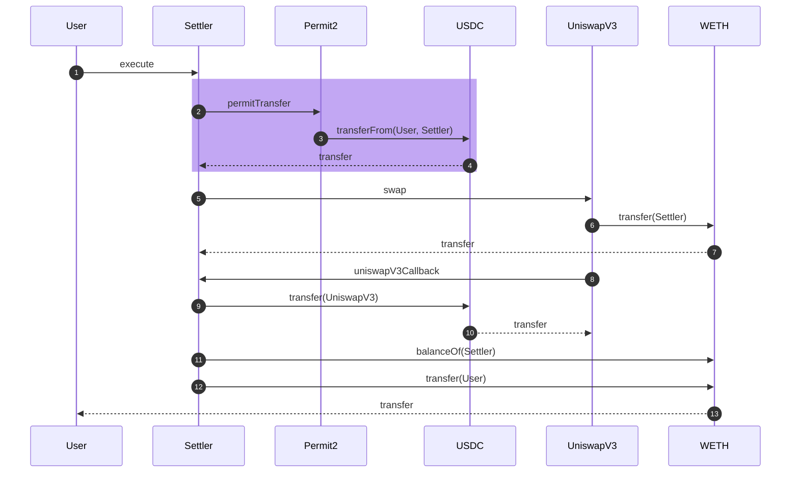

The above example shows the simplest form of settlement in Settler. We abuse some of the sequence diagram notation to get the point across. Token transfers are represented by dashes (-->). Normal contract calls are represented by solid lines. Highlighted in purple is the Permit2 interaction.

For the sake of brevity, following diagrams will have a simplified representation to showcase the internal flow. This is what we are actually interested in describing. The initial user interaction (e.g their call to Settler) and the final transfer is omitted unless it is relevant to highlight in the flow. Function calls to the DEX may only be representative of the flow, not the accurate function name.

Below is the simplified version of the above flow.

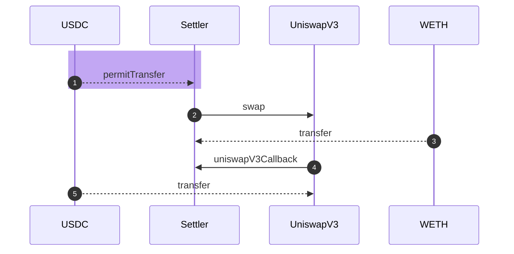

## Basic Flow

This is the most basic flow and a flow that a number of dexes support. Essentially it is the "call function on DEX, DEX takes tokens from us, DEX gives us tokens". It has inefficiencies as `transferFrom` is more gas expensive than `transfer` and we are required to check/set allowances to the DEX. Typically this DEX also does not support a `recipient` field, introducing yet another needless `transfer` in simple swaps.

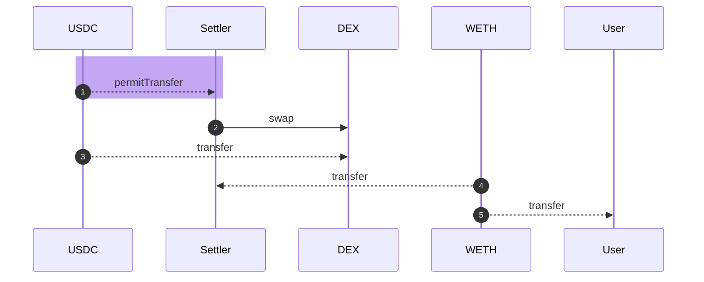

## VIPs

Settler has a number of specialised fill flows and will add more overtime as we add support for more dexes.

### UniswapV3

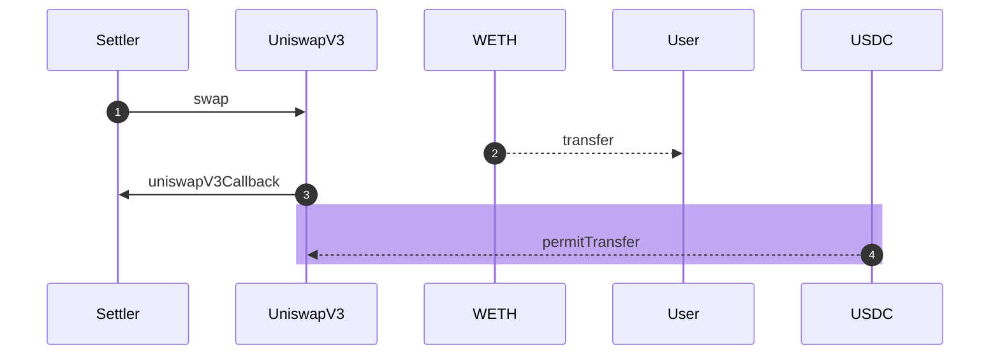

In this flow we avoid extraneous transfers with two optimisations. Firstly, we utilise the `recipient` field of UniswapV3, providing the User as the recipient and avoiding an extra transfer. Secondly during the `uniswapV3Callback` we execute the Permit2 transfer, paying the UniswapV3 pool instead of the Settler contract, avoiding an extra transfer.

This allows us to achieve **no custody** during this flow and is an extremely gas efficient way to fill a single UniswapV3 pool, or single chain of UniswapV3 pools.

Note this has the following limitations:

- Single UniswapV3 pool or single chain of pools (e.g ETH->DAI->USDC)
- Cannot support a split between pools (e.g ETH->USDC 5bps and ETH->USDC 1bps) as Permit2 transfer can only occur once. a 0xV4 equivalent would be `sellTokenForTokenToUniswapV3` as opposed to `MultiPlex[sellTokenForEthToUniswapV3,sellTokenForEthToUniswapV3]`.

## RFQ

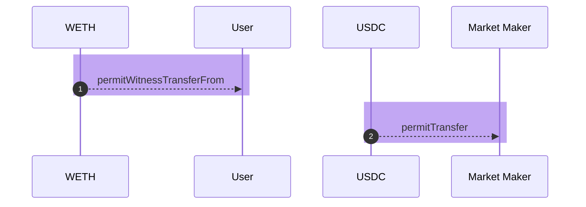

For RFQ we utilize 2 Permit2 Transfers, one for the `Market Maker->User` and another for `User->Market Maker`. This allows us to achieve **no custody** during this flow and is an extremely gas efficient way to fill RFQ orders. We simply validate the RFQ order (e.g Taker/tx.origin).

Note the `permitWitnessTransferFrom`, we utilise the `Witness` functionality of Permit2 which allows arbitrary data to be attached to the Permit2 coupon. This arbitrary data is the actual RFQ order itself, containing the taker/tx.origin and maker/taker amount and token fields.

```solidity
struct RfqOrder {
    address makerToken;
    address takerToken;
    uint128 makerAmount;
    uint128 takerAmount;
    address maker;
    address taker;
    address txOrigin;
}
```

A Market maker signs a slightly different Permit2 coupon than a User which contains these additional fields. The EIP712 type the Market Maker signs is as follows:

```solidity
PermitWitnessTransferFrom(TokenPermissions permitted, address spender, uint256 nonce, uint256 deadline, RfqOrder order)
RfqOrder(address makerToken,address takerToken,uint128 makerAmount,uint128 takerAmount,address maker,address taker,address txOrigin)
TokenPermissions(address token,uint256 amount)"
```

We use the Permit2 guarantees of a Permit2 coupon to ensure the following:

- RFQ Order cannot be filled more than once
- RFQ Orders expire
- RFQ Orders are signed by the Market Maker

## Fees in Basic Flow

In the most Basic flow, Settler has **taken custody**, usually in both assets. So a fee can be paid out be Settler.

### Sell token fee

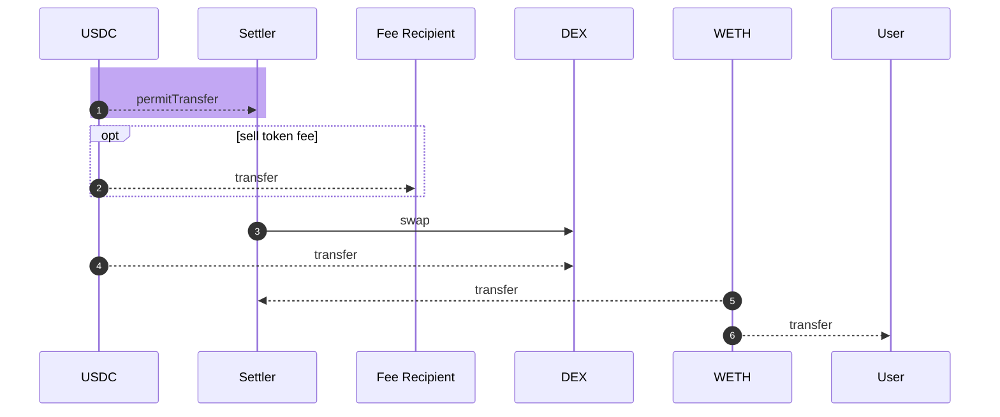

It is also possible to utilise Permit2 to pay out the Sell token fee using a batch permit, where the second item in the batch is the amount to payout.

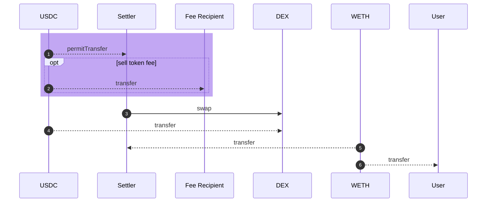

### Buy token fee

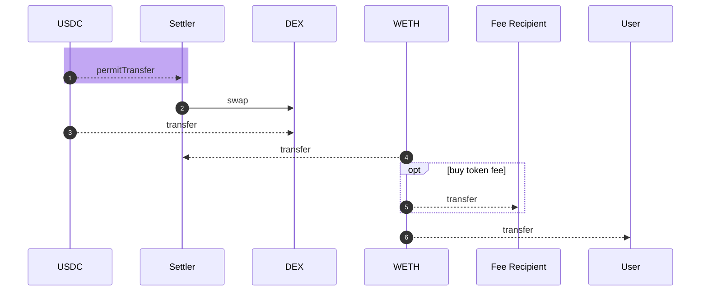

## Fees via Permit2

It is possible to collect fees via Permit2, which is typically in the token that the Permit2 is offloading (e.g the sell token for that counterparty). To perform this we use the Permit2 batch functionality where the second item in the batch is the fee.

### RFQ fees via Permit2

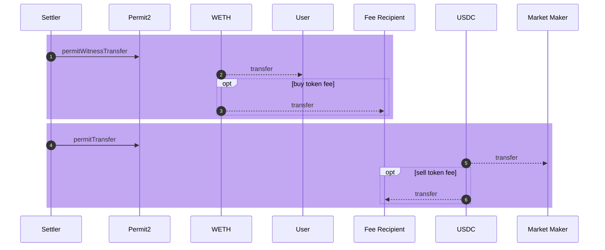

Using the Batch functionality we can do one or more transfers from either the User or the Market Maker. Allowing us to take either a buy token fee or a sell token fee, or both, during RFQ order settlement.

This allows us to achieve **no custody** during this flow and is an extremely gas efficient way to fill RFQ orders with fees.

### Uniswap VIP sell token fees via Permit2

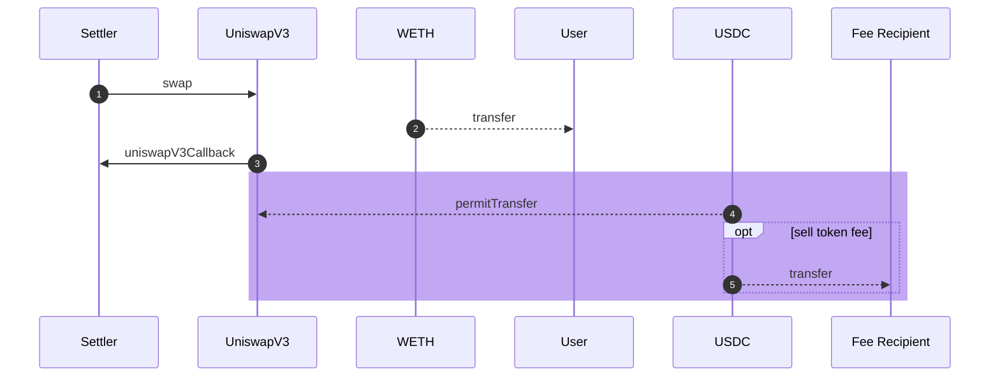

It is possible to collect sell token fees via Permit2 with the UniswapV3 VIP as well, using the Permit2 batch functionality. This flow is similar to the RFQ fees.

This allows us to achieve **no custody** during this flow and is an extremely gas efficient way to fill UniswapV3 with sell token fees.

### Uniswap buy token fees via Permit2

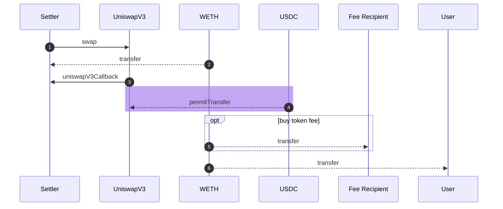

Since UniswapV3 only supports a single `recipient`, to collect buy token fees, Settler must **take custody** of the buy token. These additional transfers makes settlement with UniswapV3 and buy token fees slightly more expensive than with sell token fees.

## MetaTransactions

Similar to RFQ orders, MetaTransactions use the Permit2 with witness. In this case the witness is the MetaTransaction itself, containing the actions the user wants to execute. This gives MetaTransactions access to the same flows above, with a slightly different entrypoint to decode the actions from the Permit2 coupon, rather than the actions being provided directly in the arguments to the execute function.

The EIP712 type the user signs when wanting to perform a metatransaction is:

```
PermitWitnessTransferFrom(TokenPermissions permitted,address spender,uint256 nonce,uint256 deadline,bytes[] actions)
TokenPermissions(address token,uint256 amount)
```

Where `actions` is added and contains the encoded actions the to perform.


## AllowanceHolder
As an intermediary step, we provide the `AllowanceHolder` contract. This sits infront of 0x Settler and acts as transparently as possible. 0x Settler has a one way trust relationship to `AllowanceHolder`. The true `msg.sender` is forwarded from `AllowanceHolder` to 0x Settler in a similar way to [ERC-2771](https://eips.ethereum.org/EIPS/eip-2771). `Permit2` is not used in conjunction with `AllowanceHolder`

`execute`: An EOA or a Contract can utilise this function to perform a swap via 0x Settler. Tokens are transferred efficiently and on-demand as the swap executes

Highlighted in orange is the standard token transfer operations. Note: these are not the most effiecient swaps available, just enough to demonstrate the point.

`execute` transfers the tokens on demand in the middle of the swap


# How to deploy

## How to pause the contracts

First, decide how much of everyone's day you're going to ruin. Is the bug
contained to a single `Settler` instance? Or is the bug pervasive? If the bug is
pervasive, you're going to completely ruin everybody's day. Skip steps 3 through
6 below.

You need to be an approved deployer. The "pause" operation is 1-of-n, not 2-of-n
like deploying a new `Settler`. `0x1CeC01DC0fFEE5eB5aF47DbEc1809F2A7c601C30`
(ice cold coffees) is the address of the pauser contract. It's at the same
address on all chains unless somebody screwed up the vanity addresses and didn't
update this document.

0. Go to that address on the relevant block explorer.

1. Click on the "Contract" tab.


2. Click on the "Write Contract" tab.


3. Click on "remove", the first one.


4. Click on "Connect to Web3" and allow your wallet to connect. You must connect
   with the address that you use to deploy.


5. Paste the address of the buggy `Settler` instance.


6. Click "Write" and confirm the transaction in your wallet. You have successfully ruined everybody's day :+1:


7. This is the step to take if you want to completely shut down the
   protocol. You really hate that everybody is having a nice day. Instead of
   clicking on "remove"; click on "removeAll".

8. Click on "Connect to Web3" and allow your wallet to connect. You must connect
   with the address that you use to deploy.


9. Enter the "feature" number in the text box. This is probably 2 for
   taker-submitted for 3 for gasless/metatransaction, unless something major has
   changed and nobody bothered to update this document.


10. Click "Write" and confirm the transaction in your wallet. You have _really_ ruined everybody's day :+1:


## How to deploy a new `Settler` to a chain that is already set up

Populate `api_secrets.json` by copying
[`api_secrets.json.template`](api_secrets.json.template) and adding your own
block explorer API key and RPC.

You need 2 signers to do this. The first person runs
[`./sh/confirm_new_settler.sh`](sh/confirm_new_settler.sh). This is incompatible
with the "unlocked" type of wallet. You must use a Ledger, Trezor, or hot
wallet. Following the prompts, this will sign the Safe transaction required to
submit the deployment.

The second person then runs
[`./sh/deploy_new_settler.sh`](sh/deploy_new_settler.sh). This doesn't need an
extra signature (thanks Safe!). Your wallet will ask you to confirm transaction
submission. Assuming nothing goes wrong (if it does, file a bug report), you
should have a brand-new `Settler`. It also should submit the contract for
verification on the relevant explorer ([unless you're on
Arbitrum](https://twitter.com/duncancmt/status/1775893476342964464)).

## How to deploy to a new chain

Zeroth, verify the configuration for your chain in
[`chain_config.json`](chain_config.json) and
[`script/SafeConfig.sol`](script/SafeConfig.sol).

First, you need somebody to give you a copy of `secrets.json`. If you don't have
this, give up. Also populate `api_secrets.json` by copying
[`api_secrets.json.template`](api_secrets.json.template) and adding your own
block explorer API key and RPC.

Second, you need have enough native asset in each of the deployer addresses
listed in [`secrets.json.template`](secrets.json.template) to perform the
deployment. If how much isn't obvious to you, you can run the main deployment
script with `BROADCAST=no` to simulate. This can be a little wonky on L2s, so
beware and overprovision the amount of native asset.

Third, deploy `AllowanceHolder`. Obviously, if you're deploying to a
Cancun-supporting chain, you don't need to fund the deployer for the old
`AllowanceHolder` (and vice versa). Run [`./sh/deploy_allowanceholder.sh
<CHAIN_NAME>`](sh/deploy_allowanceholder.sh).

Fourth, check that the Safe deployment on the new chain is complete. You can
check this by running the main deployment script with `BROADCAST=no`. If it
completes without reverting, you don't need to do anything. If the Safe
deployment on the new chain is incomplete, run [`./sh/deploy_safe_infra.sh
<CHAIN_NAME>`](sh/deploy_safe_infra.sh). You will have to modify this script.

Fifth, make _damn_ sure that you've got the correct configuration in
[`chain_config.json`](chain_config.json). If you screw this up, you'll burn the
vanity address. Run [`BROADCAST=no ./sh/deploy_new_chain.sh
<CHAIN_NAME>`](sh/deploy_new_chain.sh) a bunch of times. Deploy to a
testnet. Simulate each individual transaction in
[Tenderly](https://dashboard.tenderly.co/).

Finally, run `BROADCAST=yes ./sh/deploy_new_chain.sh <CHAIN_NAME>`. Cross your
fingers. If something goes wrong (most commonly, the second-to-last transaction
runs out of gas; this is only a minor problem), you'll need to edit either
`sh/deploy_new_chain.sh` or
[`script/DeploySafes.s.sol`](script/DeploySafes.s.sol) to skip the parts of the
deployment you've already done. Tweak `gasMultiplierPercent` and
`minGasPriceGwei` in `chain_config.json`.

Congratulations, `Settler` is deployed on a new chain! :tada:
