# 0x Settler

0x Settler is a gas-efficient swap settlement protocol that utilizes [Permit2](https://github.com/Uniswap/permit2) to execute trades without requiring passive ERC20 allowances to the exchange contract.

## What is Settler?

Settler is the execution layer for 0x's modern swap aggregation. It is designed to be:
*   **Secure**: Zero passive allowances to Settler itself.
*   **Efficient**: Optimized for gas usage by leveraging Permit2's specific transfer capabilities.
*   **Flexible**: Supports various liquidity sources (Uniswap V3, RFQ, Curve, etc.) and settlement mechanisms (Direct execution, Metatransactions, Intents).

## Why Permit2?

Settler relies exclusively on Uniswap's **Permit2** for token transfers. This architecture offers significant advantages:
*   **Security**: Users approve the canonical Permit2 contract once, rather than approving every new exchange protocol. Settler pulls funds only when a trade is explicitly signed and executed.
*   **Expiring Permissions**: Signatures (coupons) have strict deadlines, reducing the risk of indefinite approvals being exploited later.
*   **Efficiency**: Allows for features like batched transfers and witness data (used for RFQ and Metatransaction validation), reducing gas costs compared to traditional "approve then swap" flows.

## How it Works

1.  **Quote**: An integrator (or the 0x API) requests a quote for a swap.
2.  **Sign**: The user signs a Permit2 coupon. This off-chain signature authorizes the specific trade terms (token, amount, spender, deadline).
3.  **Execute**: The integrator submits the transaction to the `Settler` contract (or a `Settler` intent/metatransaction processor).
4.  **Settle**:
    *   Settler calls `Permit2` to validate the signature and pull the user's tokens.
    *   Settler swaps the tokens through the selected liquidity source (e.g., Uniswap V3, Private Maker).
    *   Output tokens are sent directly to the user (or target recipient).

## Integration Guide

Integrators should interact with Settler by generating the appropriate calldata (typically via 0x API) which includes the necessary Permit2 signature.

**Finding the correct deployment:**
Do not hardcode Settler addresses, as they may be updated for new features or fixes. Use the on-chain Registry/Deployer to resolve the current active address.

## How do I find the most recent deployment?

The 0x Settler deployer/registry contract is deployed to
`0x00000000000004533Fe15556B1E086BB1A72cEae` across all chains (unless somebody
screwed up the vanity address and didn't update this document). The
deployer/registry is an ERC1967 UUPS upgradeable contract that implements an
ERC721-compatible NFT. To find the address of the most recent `Settler`
deployment, call `function ownerOf(uint256 tokenId) external view returns (address)`
with the `tokenId` set to the number of the feature that you wish to query. For
taker-submitted flows, the feature number is probably 2 unless something major
changed and nobody updated this document. For gasless/metatransaction flows, the
feature number is probably 3. For intents, the feature number is probably 4. For
bridge settler, the feature number is probably 5. A reverting response indicates
that `Settler` is paused and you should not interact. Do not hardcode any `Settler`
address in your integration. _**ALWAYS**_ query the deployer/registry for the address
of the most recent `Settler` contract before building or signing a transaction,
metatransaction, or order.

### 0x API dwell time

There is some lag between the deployment of a new instance of 0x Settler and
when 0x API begins generating calldata targeting that instance. This allows 0x
to perform extensive end-to-end testing to ensure zero downtime for
integrators. During this "dwell" period, a strict comparison between the
[`.transaction.to`](https://0x.org/docs/api#tag/Swap/operation/swap::permit2::getQuote)
field of the API response and the result of querying
`IERC721(0x00000000000004533Fe15556B1E086BB1A72cEae).ownerOf(...)` will
fail. For this reason, there is a fallback. If `ownerOf` does not revert, but
the return value isn't the expected value, _**YOU SHOULD ALSO**_ query the
selector `function prev(uint128) external view returns (address)` with the same
argument. If the response from this function call does not revert and the result
is the expected address, then the 0x API is in the dwell time and you may
proceed as normal.

<details>
<summary>Example Solidity code for checking whether Settler is genuine</summary>

```Solidity
interface IERC721Tiny {
    function ownerOf(uint256 tokenId) external view returns (address);
}
interface IDeployerTiny is IERC721Tiny {
    function prev(uint128 featureId) external view returns (address);
}

IDeployerTiny constant ZERO_EX_DEPLOYER =
    IDeployerTiny(0x00000000000004533Fe15556B1E086BB1A72cEae);

error CounterfeitSettler(address);

function requireGenuineSettler(uint128 featureId, address allegedSettler)
    internal
    view
{
    // Any revert in `ownerOf` or `prev` will be bubbled. Any error in
    // ABIDecoding the result will result in a revert without a reason string.
    if (ZERO_EX_DEPLOYER.ownerOf(featureId) != allegedSettler
        && ZERO_EX_DEPLOYER.prev(featureId) != allegedSettler) {
        revert CounterfeitSettler(allegedSettler);
    }
}
```

While the above code is the _**strongly recommended**_ approach, it is
comparatively gas-expensive. A more gas-optimized approach is demonstrated
below, but it does not cover the case where Settler has been paused due to a
bug.

```Solidity
function computeGenuineSettler(uint128 featureId, uint64 deployNonce)
    internal
    view
    returns (address)
{
    address zeroExDeployer = 0x00000000000004533Fe15556B1E086BB1A72cEae;
    bytes32 salt = bytes32(
        uint256(featureId) << 128 | uint256(block.chainid) << 64
            | uint256(deployNonce)
    );
    // for London hardfork chains, substitute
    // 0x1774bbdc4a308eaf5967722c7a4708ea7a3097859cb8768a10611448c29981c3
    bytes32 shimInitHash =
        0x3bf3f97f0be1e2c00023033eefeb4fc062ac552ff36778b17060d90b6764902f;
    address shim =
        address(
            uint160(
                uint256(
                    keccak256(
                        abi.encodePacked(
                            bytes1(0xff),
                            zeroExDeployer,
                            salt,
                            shimInitHash
                        )
                    )
                )
            )
        );
    address settler =
        address(
            uint160(
                uint256(
                    keccak256(
                        abi.encodePacked(bytes2(0xd694), shim, bytes1(0x01))
                    )
                )
            )
        );
    return settler;
}
```

</details>

### AllowanceHolder addresses

AllowanceHolder is deployed to the following addresses depending on the most
advanced EVM hardfork supported on the chain. You can hardcode this address in
your integration.

* `0x0000000000001fF3684f28c67538d4D072C22734` on chains supporting the Cancun
  hardfork (Ethereum mainnet, Ethereum Sepolia testnet, Polygon, Base, Optimism,
  Arbitrum, Blast, Bnb, Mode, World Chain, Gnosis, Fantom Sonic, Ink, Monad
  testnet, Avalanche, Unichain, Berachain, Scroll, HyperEvm, Katana, Plasma,
  Monad mainnet, Abstract, Linea, Tempo)
* `0x0000000000005E88410CcDFaDe4a5EfaE4b49562` on chains supporting the Shanghai
  hardfork (Mantle, Taiko)

### ERC2771 forwarding MultiCall address

The ERC2771 forwarding `MultiCall` is deployed to
`0x00000000000000CF9E3c5A26621af382fA17f24f` across all chains. You can hardcode
this address in your integration. I have no idea why you would want to do that,
but I guess it's a thing that you can do. The ERC2771 forwarding MultiCall is
exclusively used by 0x's solvers for the `SettlerIntent` flavor of 0x Settler.

### `CrossChainReceiverFactory` address

`CrossChainReceiverFactory` is deployed to
`0x00000000000000304861c3aDfb80dd5ebeC96325` across all chains. You can hardcode
this address in your integration. This contract is used to deploy counterfactual
(submarine) addresses to facilitate swapping and other actions on foreign chains
after bridging.

### Permit2 address

Permit2 is deployed to `0x000000000022D473030F116dDEE9F6B43aC78BA3` across all
chains. You can hardcode this address in your integration.

### Examples

#### TypeScript ([viem](https://viem.sh/))

<details>
<summary>Click to see TypeScript example of getting Settler addresses</summary>

```TypeScript
import { createPublicClient, http, parseAbi } from 'viem';

(async function main() {
    const client = createPublicClient({
        transport: http(process.env.RPC_URL),
    });

    const deployer = "0x00000000000004533Fe15556B1E086BB1A72cEae";
    const tokenDescriptions = {
        2: "taker submitted",
        3: "metatransaction",
        4: "intents",
        5: "bridge",
    };

    const deployerAbi = parseAbi([
        "function prev(uint128) external view returns (address)",
        "function ownerOf(uint256) external view returns (address)",
        "function next(uint128) external view returns (address)",
    ]);
    const functionDescriptions = {
        "prev": "previous",
        "ownerOf": "current",
        "next": "next",
    };

    const blockNumber = await client.getBlockNumber();
    for (let tokenId in tokenDescriptions) {
        for (let functionName in functionDescriptions) {
            let addr = await client.readContract({
                address: deployer,
                abi: deployerAbi,
                functionName,
                args: [tokenId],
                blockNumber,
            });
            console.log(functionDescriptions[functionName] + " " + tokenDescriptions[tokenId] + " settler address " + addr);
        }
    }

    // output:
    // previous taker submitted settler address 0xDf31A70a21A1931e02033dBBa7DEaCe6c45cfd0f
    // current taker submitted settler address 0xD07C4F45bc9B389d286CB094F97BB6Ba45f4Bb30
    // next taker submitted settler address 0x207e1074858A7e78f17002075739eD2745dbaEce
    // previous metatransaction settler address 0x8e3F00919aD73B4C525BE50E86718d86386AF944
    // current metatransaction settler address 0x42b17b6B6b93383d52F21Dc61546974E014241bf
    // next metatransaction settler address 0x1e1Ed00F1048C99240bB56defC20de44A0A005Cb
    // previous intents settler address 0x8331f9ACcE69b02C281F40a00706f758665ccE77
    // current intents settler address 0xF3D5719F7E3b49A4c3797d56BD3FED6D3B80F0F9
    // next intents settler address 0x25233dDD68dAc9ac40E1E8D80c58d36b524032b2
    // previous bridge settler address 0x37C15fed8F78C252d272c47FaF9564d0C5350D29
    // current bridge settler address 0x2aaEECD66779f1B517abAD78611115a99E0558c2
    // next bridge settler address 0x3DECc6d88C2F0fa5cFa3B4f0AcEb3FE60Afc2B30
})();
```

</details>

#### JavaScript ([Ethers.js](https://docs.ethers.org/v5/))

<details>
<summary>Click to see JavaScript example of getting Settler addresses</summary>

Note that this example uses version 5 of `Ethers.js`. The current version of
`Ethers.js` is 6, which is not compatible with this snippet.

```JavaScript
"use strict";
const {ethers} = require("ethers");

(async function main() {
  const provider = new ethers.providers.JsonRpcProvider(process.env.RPC_URL);

  const deployerAddress = "0x00000000000004533Fe15556B1E086BB1A72cEae";
  const tokenDescriptions = {
    2: "taker submitted",
    3: "metatransaction",
    4: "intents",
    5: "bridge",
  };

  const deployerAbi = [
    "function prev(uint128) external view returns (address)",
    "function ownerOf(uint256) external view returns (address)",
    "function next(uint128) external view returns (address)",
  ];
  const functionDescriptions = {
    "prev": "previous",
    "ownerOf": "current",
    "next": "next",
  };

  const deployer = new ethers.Contract(deployerAddress, deployerAbi, provider);
  for (let tokenId in tokenDescriptions) {
    for (let functionName in functionDescriptions) {
      let addr = await deployer[functionName](tokenId);
      console.log(functionDescriptions[functionName] + " " + tokenDescriptions[tokenId] + " settler address " + addr);
    }
  }

  // output:
  // previous taker submitted settler address 0xDf31A70a21A1931e02033dBBa7DEaCe6c45cfd0f
  // current taker submitted settler address 0xD07C4F45bc9B389d286CB094F97BB6Ba45f4Bb30
  // next taker submitted settler address 0x207e1074858A7e78f17002075739eD2745dbaEce
  // previous metatransaction settler address 0x8e3F00919aD73B4C525BE50E86718d86386AF944
  // current metatransaction settler address 0x42b17b6B6b93383d52F21Dc61546974E014241bf
  // next metatransaction settler address 0x1e1Ed00F1048C99240bB56defC20de44A0A005Cb
  // previous intents settler address 0x8331f9ACcE69b02C281F40a00706f758665ccE77
  // current intents settler address 0xF3D5719F7E3b49A4c3797d56BD3FED6D3B80F0F9
  // next intents settler address 0x25233dDD68dAc9ac40E1E8D80c58d36b524032b2
  // previous bridge settler address 0x37C15fed8F78C252d272c47FaF9564d0C5350D29
  // current bridge settler address 0x2aaEECD66779f1B517abAD78611115a99E0558c2
  // next bridge settler address 0x3DECc6d88C2F0fa5cFa3B4f0AcEb3FE60Afc2B30
})();
```

</details>

#### Rust ([Alloy](https://github.com/alloy-rs))

<details>
<summary>Cargo.toml</summary>

```toml
[package]
name = "scratch"
version = "0.1.0"
edition = "2021"

[dependencies]
alloy = { git = "https://github.com/alloy-rs/alloy", rev = "e22d9be", features = [
    "contract",
    "network",
    "providers",
    "provider-http",
    "rpc-client",
    "rpc-types-eth",
    "rpc-types-trace",
] }
eyre = "0.6.12"
tokio = { version = "1.37.0", features = ["rt-multi-thread", "macros"] }
```

</details>

<details>
<summary>Click to see Rust example of getting Settler addresses</summary>

```Rust
use alloy::{
    network::TransactionBuilder,
    primitives::{address, Address, Bytes, U256},
    providers::{Provider, ProviderBuilder},
    rpc::types::eth::{BlockId, TransactionRequest},
    sol,
    sol_types::SolCall,
};
use eyre::Result;
use std::collections::HashMap;
use std::env;

const DEPLOYER_ADDRESS: Address = address!("00000000000004533Fe15556B1E086BB1A72cEae");

sol! {
    function prev(uint128 featureId) external view returns (address pastTokenOwner);
    function ownerOf(uint256 tokenId) external view returns (address tokenOwner);
    function next(uint128 featureId) external view returns (address futureTokenOwner);
}

#[tokio::main]
async fn main() -> Result<()> {
    let provider = ProviderBuilder::new().on_http(env::var("RPC_URL")?.parse()?);
    let block_id = BlockId::number(provider.get_block_number().await?);

    let token_ids = vec![2, 3, 4];
    let token_descriptions = HashMap::from([
        (2, "taker submitted"),
        (3, "metatransaction"),
        (4, "intents"),
        (5, "bridge")
    ]);

    for token_id in token_ids.iter() {
        {
            let tx = TransactionRequest::default()
                .with_to(DEPLOYER_ADDRESS)
                .with_input(Bytes::from(
                    prevCall {
                        featureId: *token_id,
                    }
                    .abi_encode(),
                ));
            let past_owner =
                prevCall::abi_decode_returns(&provider.call(&tx).block(block_id).await?, false)?
                    .pastTokenOwner;
            println!(
                "previous {0:} settler address {1:}",
                token_descriptions[token_id], past_owner
            );
        }
        {
            let tx = TransactionRequest::default()
                .with_to(DEPLOYER_ADDRESS)
                .with_input(Bytes::from(
                    ownerOfCall {
                        tokenId: U256::from(*token_id),
                    }
                    .abi_encode(),
                ));
            let token_owner =
                ownerOfCall::abi_decode_returns(&provider.call(&tx).block(block_id).await?, false)?
                    .tokenOwner;
            println!(
                "current {0:} settler address {1:}",
                token_descriptions[token_id], token_owner
            );
        }
        {
            let tx = TransactionRequest::default()
                .with_to(DEPLOYER_ADDRESS)
                .with_input(Bytes::from(
                    nextCall {
                        featureId: *token_id,
                    }
                    .abi_encode(),
                ));
            let future_owner =
                nextCall::abi_decode_returns(&provider.call(&tx).block(block_id).await?, false)?
                    .futureTokenOwner;
            println!(
                "next {0:} settler address {1:}",
                token_descriptions[token_id], future_owner
            );
        }
    }

    // output:
    // previous taker submitted settler address 0xDf31A70a21A1931e02033dBBa7DEaCe6c45cfd0f
    // current taker submitted settler address 0xD07C4F45bc9B389d286CB094F97BB6Ba45f4Bb30
    // next taker submitted settler address 0x207e1074858A7e78f17002075739eD2745dbaEce
    // previous metatransaction settler address 0x8e3F00919aD73B4C525BE50E86718d86386AF944
    // current metatransaction settler address 0x42b17b6B6b93383d52F21Dc61546974E014241bf
    // next metatransaction settler address 0x1e1Ed00F1048C99240bB56defC20de44A0A005Cb
    // previous intents settler address 0x8331f9ACcE69b02C281F40a00706f758665ccE77
    // current intents settler address 0xF3D5719F7E3b49A4c3797d56BD3FED6D3B80F0F9
    // next intents settler address 0x25233dDD68dAc9ac40E1E8D80c58d36b524032b2
    // previous bridge settler address 0x37C15fed8F78C252d272c47FaF9564d0C5350D29
    // current bridge settler address 0x2aaEECD66779f1B517abAD78611115a99E0558c2
    // next bridge settler address 0x3DECc6d88C2F0fa5cFa3B4f0AcEb3FE60Afc2B30

    Ok(())
}
```

</details>

#### Python ([web3.py](https://web3py.readthedocs.io/en/stable/))

<details>
<summary>Click to see Python example of getting Settler addresses</summary>

```Python
import os, web3

w3 = web3.Web3(web3.Web3.HTTPProvider(os.getenv("RPC_URL")))
deployer_address = "0x00000000000004533Fe15556B1E086BB1A72cEae"
token_descriptions = {
    2: "taker submitted",
    3: "metatransaction",
    4: "intents",
    5: "bridge",
}

deployer_abi = [
    {
        "constant": True,
        "inputs": [{"name": "featureId", "type": "uint128"}],
        "name": "prev",
        "outputs": [{"name": "pastTokenOwner", "type": "address"}],
        "payable": False,
        "type": "function",
    },
    {
        "constant": True,
        "inputs": [{"name": "tokenId", "type": "uint256"}],
        "name": "ownerOf",
        "outputs": [{"name": "tokenOwner", "type": "address"}],
        "payable": False,
        "type": "function",
    },
    {
        "constant": True,
        "inputs": [{"name": "featureId", "type": "uint128"}],
        "name": "next",
        "outputs": [{"name": "futureTokenOwner", "type": "address"}],
        "payable": False,
        "type": "function",
    },
]
function_descriptions = {
    "prev": "previous",
    "ownerOf": "current",
    "next": "next",
}

deployer = w3.eth.contract(address=deployer_address, abi=deployer_abi)

for token_id, token_description in token_descriptions.items():
    for function_name, function_description in function_descriptions.items():
        settler_address = getattr(deployer.functions, function_name)(token_id).call()
        print(
            function_description,
            token_description,
            "settler address",
            settler_address,
        )

# output:
# previous taker submitted settler address 0xDf31A70a21A1931e02033dBBa7DEaCe6c45cfd0f
# current taker submitted settler address 0xD07C4F45bc9B389d286CB094F97BB6Ba45f4Bb30
# next taker submitted settler address 0x207e1074858A7e78f17002075739eD2745dbaEce
# previous metatransaction settler address 0x8e3F00919aD73B4C525BE50E86718d86386AF944
# current metatransaction settler address 0x42b17b6B6b93383d52F21Dc61546974E014241bf
# next metatransaction settler address 0x1e1Ed00F1048C99240bB56defC20de44A0A005Cb
# previous intents settler address 0x8331f9ACcE69b02C281F40a00706f758665ccE77
# current intents settler address 0xF3D5719F7E3b49A4c3797d56BD3FED6D3B80F0F9
# next intents settler address 0x25233dDD68dAc9ac40E1E8D80c58d36b524032b2
# previous bridge settler address 0x37C15fed8F78C252d272c47FaF9564d0C5350D29
# current bridge settler address 0x2aaEECD66779f1B517abAD78611115a99E0558c2
# next bridge settler address 0x3DECc6d88C2F0fa5cFa3B4f0AcEb3FE60Afc2B30
```

</details>

#### Bash ([Foundry `cast`](https://book.getfoundry.sh/cast/))

<details>
<summary>Click to see Bash (cast) example of getting Settler addresses</summary>

```Bash
#!/usr/bin/env bash

set -Eeufo pipefail -o posix

if ! hash cast &>/dev/null ; then
    echo 'foundry is not installed' >&2
    exit 1
fi

declare -r deployer='0x00000000000004533Fe15556B1E086BB1A72cEae'

declare -A token_descriptions
token_descriptions[2]='taker submitted'
token_descriptions[3]='metatransaction'
token_descriptions[4]='intents'
token_descriptions[5]='bridge'
declare -r -A token_descriptions

declare -r -a function_signatures=('prev(uint128)(address)' 'ownerOf(uint256)(address)' 'next(uint128)(address)')
declare -A function_descriptions
function_descriptions["${function_signatures[0]%%(*}"]='previous'
function_descriptions["${function_signatures[1]%%(*}"]='current'
function_descriptions["${function_signatures[2]%%(*}"]='next'
declare -r -A function_descriptions

declare -i token_id
for token_id in "${!token_descriptions[@]}" ; do
    declare function_signature
    for function_signature in "${function_signatures[@]}" ; do
        declare addr
        addr="$(cast call --rpc-url "$RPC_URL" "$deployer" "$function_signature" "$token_id")"
        function_signature="${function_signature%%(*}"
        echo "${function_descriptions["$function_signature"]}"' '"${token_descriptions[$token_id]}"' settler address '"$addr" >&2
    done
done

# output:
# previous bridge settler address 0x37C15fed8F78C252d272c47FaF9564d0C5350D29
# current bridge settler address 0x2aaEECD66779f1B517abAD78611115a99E0558c2
# next bridge settler address 0x3DECc6d88C2F0fa5cFa3B4f0AcEb3FE60Afc2B30
# previous intents settler address 0x8331f9ACcE69b02C281F40a00706f758665ccE77
# current intents settler address 0xF3D5719F7E3b49A4c3797d56BD3FED6D3B80F0F9
# next intents settler address 0x25233dDD68dAc9ac40E1E8D80c58d36b524032b2
# previous metatransaction settler address 0x8e3F00919aD73B4C525BE50E86718d86386AF944
# current metatransaction settler address 0x42b17b6B6b93383d52F21Dc61546974E014241bf
# next metatransaction settler address 0x1e1Ed00F1048C99240bB56defC20de44A0A005Cb
# previous taker submitted settler address 0xDf31A70a21A1931e02033dBBa7DEaCe6c45cfd0f
# current taker submitted settler address 0xD07C4F45bc9B389d286CB094F97BB6Ba45f4Bb30
# next taker submitted settler address 0x207e1074858A7e78f17002075739eD2745dbaEce
```

</details>

### Checking out the commit of a Settler

Settler emits the following event when it is deployed:

```Solidity
event GitCommit(bytes20 indexed);
```

By retrieving the argument of this event, you get the git commit from which the
Settler was built. For convenience, the script [`./sh/checkout_settler_commit.sh
<CHAIN_NAME>`](sh/checkout_settler_commit.sh) will pull the latest Settler
address, read the deployment event, and checkout the git commit.

## Bug Bounty Program

0x hosts a bug bounty on Immunefi at the address
https://immunefi.com/bug-bounty/0x .

If you have found a vulnerability in our project, it must be submitted through
Immunefi's platform. Immunefi will handle bug bounty communications.

See the bounty page at Immunefi for more details on accepted vulnerabilities,
payout amounts, and rules of participation.

Users who violate the rules of participation will not receive bug bounty payouts
and may be temporarily suspended or banned from the bug bounty program.

## Custody

Custody, not like the delicious custardy, is when the token(s) being traded are
temporarily owned by the Settler contract. This sometimes implies an additional,
non-optimal transfer. There are multiple reasons that Settler takes custody of
the token, here are a few:

- In the middle of a Multihop trade (except AMMs like UniswapV2 and VelodromeV2)
- To split tokens among multiple liquidity sources (Multiplex)
- To distribute positive slippage from an AMM
- To pay fees to a fee recipient in the buy token from an AMM
- Trading against an inefficient AMM that only supports `transferFrom(msg.sender)` (e.g Curve)

For the above reasons, there are settlement paths in Settler which allow for
custody of the sell token or the buy token. You will see the usage of `custody`
to represent this. Sell token or Buy token or both custody is represented by
`custody`.

## Gas usage

Gas cost snapshots are stored under `./forge-snapshots`. The scope is minimized
by using [forge-gas-snapshot](https://github.com/marktoda/forge-gas-snapshot).

There is an initial cost for Permit2 when the token has not been previously
used. This adds some non-negligible cost as the storage is changed from a 0 for
the first time. For this reason we compare warm (where the nonce is non-0) and
cold.

Note: The following is more akin to `gasLimit` than it is `gasUsed`, this is due
to the difficulty in calculating pinpoint costs (and rebates) in Foundry
tests. Real world usage will be slightly lower, but it serves as a useful
comparison.

[//]: # "BEGIN TABLES"

| VIP                 | DEX        | Pair      | Gas    | %      |
| ------------------- | ---------- | --------- | ------ | ------ |
| 0x V4 VIP           | Uniswap V3 | USDC/WETH | 121309 | 0.00%  |
| 0x V4 Multiplex     | Uniswap V3 | USDC/WETH | 135211 | 11.46% |
| Settler VIP (warm)  | Uniswap V3 | USDC/WETH | 129558 | 6.80%  |
| AllowanceHolder VIP | Uniswap V3 | USDC/WETH | 121966 | 0.54%  |
| UniswapRouter V3    | Uniswap V3 | USDC/WETH | 117706 | -2.97% |
|                     |            |           |        |        |
| 0x V4 VIP           | Uniswap V3 | DAI/WETH  | 111980 | 0.00%  |
| 0x V4 Multiplex     | Uniswap V3 | DAI/WETH  | 125853 | 12.39% |
| Settler VIP (warm)  | Uniswap V3 | DAI/WETH  | 120229 | 7.37%  |
| AllowanceHolder VIP | Uniswap V3 | DAI/WETH  | 112637 | 0.59%  |
| UniswapRouter V3    | Uniswap V3 | DAI/WETH  | 108377 | -3.22% |
|                     |            |           |        |        |
| 0x V4 VIP           | Uniswap V3 | USDT/WETH | 123571 | 0.00%  |
| 0x V4 Multiplex     | Uniswap V3 | USDT/WETH | 137444 | 11.23% |
| Settler VIP (warm)  | Uniswap V3 | USDT/WETH | 131754 | 6.62%  |
| AllowanceHolder VIP | Uniswap V3 | USDT/WETH | 124162 | 0.48%  |
| UniswapRouter V3    | Uniswap V3 | USDT/WETH | 119840 | -3.02% |
|                     |            |           |        |        |
| Settler VIP (warm)  | Uniswap V3 | WETH/USDC | 129989 | NaN%   |
| UniswapRouter V3    | Uniswap V3 | WETH/USDC | 118192 | NaN%   |
|                     |            |           |        |        |

| Custody              | DEX        | Pair      | Gas    | %       |
| -------------------- | ---------- | --------- | ------ | ------- |
| 0x V4 TransformERC20 | Uniswap V3 | USDC/WETH | 239864 | 0.00%   |
| Settler              | Uniswap V3 | USDC/WETH | 158503 | -33.92% |
| AllowanceHolder      | Uniswap V3 | USDC/WETH | 150914 | -37.08% |
|                      |            |           |        |         |
| 0x V4 TransformERC20 | Uniswap V3 | DAI/WETH  | 221467 | 0.00%   |
| Settler              | Uniswap V3 | DAI/WETH  | 146459 | -33.87% |
| AllowanceHolder      | Uniswap V3 | DAI/WETH  | 138870 | -37.30% |
|                      |            |           |        |         |
| 0x V4 TransformERC20 | Uniswap V3 | USDT/WETH | 237150 | 0.00%   |
| Settler              | Uniswap V3 | USDT/WETH | 161840 | -31.76% |
| AllowanceHolder      | Uniswap V3 | USDT/WETH | 154251 | -34.96% |
|                      |            |           |        |         |
| Settler              | Uniswap V3 | WETH/USDC | 155933 | NaN%    |
|                      |            |           |        |         |

| MetaTransactions | DEX        | Pair      | Gas    | %       |
| ---------------- | ---------- | --------- | ------ | ------- |
| 0x V4 Multiplex  | Uniswap V3 | USDC/WETH | 204706 | 0.00%   |
| Settler          | Uniswap V3 | USDC/WETH | 163807 | -19.98% |
|                  |            |           |        |         |
| 0x V4 Multiplex  | Uniswap V3 | DAI/WETH  | 195377 | 0.00%   |
| Settler          | Uniswap V3 | DAI/WETH  | 151757 | -22.33% |
|                  |            |           |        |         |
| 0x V4 Multiplex  | Uniswap V3 | USDT/WETH | 206968 | 0.00%   |
| Settler          | Uniswap V3 | USDT/WETH | 167138 | -19.24% |
|                  |            |           |        |         |
|                  |            |           |        |         |

| RFQ             | DEX     | Pair      | Gas    | %       |
| --------------- | ------- | --------- | ------ | ------- |
| 0x V4           | 0x V4   | USDC/WETH | 111684 | 0.00%   |
| Settler         | Settler | USDC/WETH | 114418 | 2.45%   |
| Settler         | 0x V4   | USDC/WETH | 197968 | 77.26%  |
| AllowanceHolder | Settler | USDC/WETH | 106575 | -4.57%  |
|                 |         |           |        |         |
| 0x V4           | 0x V4   | DAI/WETH  | 78553  | 0.00%   |
| Settler         | Settler | DAI/WETH  | 94944  | 20.87%  |
| Settler         | 0x V4   | DAI/WETH  | 172898 | 120.10% |
| AllowanceHolder | Settler | DAI/WETH  | 87101  | 10.88%  |
|                 |         |           |        |         |
| 0x V4           | 0x V4   | USDT/WETH | 89665  | 0.00%   |
| Settler         | Settler | USDT/WETH | 106056 | 18.28%  |
| Settler         | 0x V4   | USDT/WETH | 188230 | 109.93% |
| AllowanceHolder | Settler | USDT/WETH | 98213  | 9.53%   |
|                 |         |           |        |         |
| Settler         | 0x V4   | WETH/USDC | 191523 | NaN%    |
|                 |         |           |        |         |

| UniversalRouter | DEX       | Pair      | Gas    | %       |
| --------------- | --------- | --------- | ------ | ------- |
| UniversalRouter | UniswapV2 | USDC/WETH | 181544 | 0.00%   |
| Settler         | UniswapV2 | USDC/WETH | 172179 | -5.16%  |
| UniversalRouter | UniswapV3 | USDC/WETH | 177838 | -2.04%  |
| Settler         | UniswapV3 | USDC/WETH | 173600 | -4.38%  |
| UniversalRouter | UniswapV4 | USDC/WETH | 142787 | -21.35% |
| Settler         | UniswapV4 | USDC/WETH | 134918 | -25.68% |
|                 |           |           |        |         |
| UniversalRouter | UniswapV2 | DAI/WETH  | 164039 | 0.00%   |
| Settler         | UniswapV2 | DAI/WETH  | 154674 | -5.71%  |
| UniversalRouter | UniswapV3 | DAI/WETH  | 168508 | 2.72%   |
| Settler         | UniswapV3 | DAI/WETH  | 164271 | 0.14%   |
| UniversalRouter | UniswapV4 | DAI/WETH  | 125454 | -23.52% |
| Settler         | UniswapV4 | DAI/WETH  | 117585 | -28.32% |
|                 |           |           |        |         |
| UniversalRouter | UniswapV2 | USDT/WETH | 176035 | 0.00%   |
| Settler         | UniswapV2 | USDT/WETH | 166644 | -5.33%  |
| UniversalRouter | UniswapV3 | USDT/WETH | 180131 | 2.33%   |
| Settler         | UniswapV3 | USDT/WETH | 175796 | -0.14%  |
| UniversalRouter | UniswapV4 | USDT/WETH | 137184 | -22.07% |
| Settler         | UniswapV4 | USDT/WETH | 129315 | -26.54% |
|                 |           |           |        |         |
| UniversalRouter | UniswapV2 | WETH/USDC | 145094 | 0.00%   |
| Settler         | UniswapV2 | WETH/USDC | 138711 | -4.40%  |
| UniversalRouter | UniswapV3 | WETH/USDC | 147774 | 1.85%   |
| Settler         | UniswapV3 | WETH/USDC | 147544 | 1.69%   |
| UniversalRouter | UniswapV4 | WETH/USDC | 109943 | -24.23% |
| Settler         | UniswapV4 | WETH/USDC | 106701 | -26.46% |
|                 |           |           |        |         |

| Curve             | DEX                   | Pair      | Gas    | %       |
| ----------------- | --------------------- | --------- | ------ | ------- |
| Settler           | CurveV2 Tricrypto VIP | USDC/WETH | 231504 | NaN%    |
|                   |                       |           |        |         |
|                   |                       |           |        |         |
| 0x V4             | Curve                 | USDT/WETH | 400453 | 0.00%   |
| Settler           | Curve                 | USDT/WETH | 366751 | -8.42%  |
| Settler           | CurveV2 Tricrypto VIP | USDT/WETH | 243871 | -39.10% |
| Curve             | Curve                 | USDT/WETH | 289673 | -27.66% |
| Curve Swap Router | Curve                 | USDT/WETH | 359811 | -10.15% |
|                   |                       |           |        |         |
|                   |                       |           |        |         |

| DODO V1 | DEX     | Pair      | Gas    | %     |
| ------- | ------- | --------- | ------ | ----- |
| Settler | DODO V1 | USDC/WETH | 292803 | 0.00% |
|         |         |           |        |       |
|         |         |           |        |       |
|         |         |           |        |       |
|         |         |           |        |       |

| Buy token fee     | DEX        | Pair      | Gas    | %     |
| ----------------- | ---------- | --------- | ------ | ----- |
| Settler - custody | Uniswap V3 | USDC/WETH | 167146 | 0.00% |
|                   |            |           |        |       |
| Settler - custody | Uniswap V3 | DAI/WETH  | 157788 | 0.00% |
|                   |            |           |        |       |
| Settler - custody | Uniswap V3 | USDT/WETH | 169313 | 0.00% |
|                   |            |           |        |       |
| Settler - custody | Uniswap V3 | WETH/USDC | 173532 | 0.00% |
|                   |            |           |        |       |

| Sell token fee | DEX        | Pair      | Gas    | %       |
| -------------- | ---------- | --------- | ------ | ------- |
| Settler        | Uniswap V3 | USDC/WETH | 172572 | 0.00%   |
|                |            |           |        |         |
| Settler        | Uniswap V3 | DAI/WETH  | 157813 | 0.00%   |
|                |            |           |        |         |
| Settler        | Uniswap V3 | USDT/WETH | 174970 | 0.00%   |
| Settler        | Curve      | USDT/WETH | 377836 | 115.94% |
|                |            |           |        |         |
| Settler        | Uniswap V3 | WETH/USDC | 167007 | 0.00%   |
|                |            |           |        |         |

| AllowanceHolder                      | DEX            | Pair      | Gas    | %       |
| ------------------------------------ | -------------- | --------- | ------ | ------- |
| execute                              | Uniswap V3 VIP | USDC/WETH | 121966 | 0.00%   |
| Settler - external move then execute | Uniswap V3     | USDC/WETH | 135342 | 10.97%  |
| execute                              | RFQ            | USDC/WETH | 106575 | -12.62% |
|                                      |                |           |        |         |
| execute                              | Uniswap V3 VIP | DAI/WETH  | 112637 | 0.00%   |
| Settler - external move then execute | Uniswap V3     | DAI/WETH  | 128851 | 14.39%  |
| execute                              | RFQ            | DAI/WETH  | 87101  | -22.67% |
|                                      |                |           |        |         |
| execute                              | Uniswap V3 VIP | USDT/WETH | 124162 | 0.00%   |
| Settler - external move then execute | Uniswap V3     | USDT/WETH | 144547 | 16.42%  |
| execute                              | RFQ            | USDT/WETH | 98213  | -20.90% |
|                                      |                |           |        |         |
| Settler - external move then execute | Uniswap V3     | WETH/USDC | 138477 | NaN%    |
|                                      |                |           |        |         |

| AllowanceHolder sell token fees | DEX | Pair      | Gas    | %      |
| ------------------------------- | --- | --------- | ------ | ------ |
| no fee                          | RFQ | USDC/WETH | 106575 | 0.00%  |
| proportional fee                | RFQ | USDC/WETH | 146678 | 37.63% |
| fixed fee                       | RFQ | USDC/WETH | 122824 | 15.25% |
|                                 |     |           |        |        |
| no fee                          | RFQ | DAI/WETH  | 87101  | 0.00%  |
| proportional fee                | RFQ | DAI/WETH  | 125217 | 43.76% |
| fixed fee                       | RFQ | DAI/WETH  | 99176  | 13.86% |
|                                 |     |           |        |        |
| no fee                          | RFQ | USDT/WETH | 98213  | 0.00%  |
| proportional fee                | RFQ | USDT/WETH | 141961 | 44.54% |
| fixed fee                       | RFQ | USDT/WETH | 111400 | 13.43% |
|                                 |     |           |        |        |
|                                 |     |           |        |        |

[//]: # "END TABLES"

### Settler vs X

#### Settler vs 0xV4

The Settler contracts must perform additional work over 0xV4, namely, invalidate
the state of the `Permit2` signed message, this is essentially an additional
`SSTORE` that must always be performed. `Permit2` also does an `ecrecover` and
(in the metatransaction case) a cold `EXTCODESIZE`. On the other side, Settler
does not need to perform the same Feature implementation lookup that 0xV4
requires as a proxy. Settler's implicit reentrancy guard uses transient
storage.

With the Curve VIP, 0xV4 has to use a LiquidityProviderSandbox as calling
untrusted/arbitrary code is a risk in the protocol. Settler can be more lax with
the calls that it makes to other contracts because it does not hold TVL or
allowances. Settler does not have an equivalent of the liquidity sandbox, making
calls directly to Curve-like contracts.

#### Settler vs Curve

The Curve pool does not allow for a `recipient` to be specified, nor does it
allow for tokens to be `transfer`'d directly into the pool prior to calling the
pool contract. Due to these limitations there is overhead from the `transfer`
out of the Settler contract to the user.  This same limitation applies to the
Curve Swap Router.

## Actions

See
[ISettlerActions](https://github.com/0xProject/0x-settler/blob/master/src/ISettlerActions.sol)
for a list of actions and their parameters. The list of actions, their names,
the type and number of arguments, and the availability by chain is _**NOT
STABLE**_. Do not rely on ABI encoding/decoding of actions directly.

### UniswapV3

This settlement path is optimized by performing the Permit2 in the
`uniswapV3SwapCallback` function performing a `permit2TransferFrom` and avoiding
an additional `transfer`. This is further benefitted from tokens being sent to a
pool with an already initialized balance, rathan than to Settler as a temporary
intermediary.

The action `UNISWAPV3_VIP` exposes this behaviour and it should not be used with
any other action that interacts directly with Permit2 (e.g
`TRANSFER_FROM`). This is a recommendation; under extraordinary circumstances it
is only possible to achieve the required behavior with multiple Permit2
interactions. Except in the case of metatransaction Settlers, it is possible to
do multiple Permit2 interactions in the same Settler call.

# Risk

Since Settler has no outstanding allowances, and no usage of
`IERC20.transferFrom`, overall risk of user funds loss is greatly reduced.

Permit2 allowances (with short dated expiration) still has some risk. Namely,
`Alice` permit2 being intercepted and a malicious transaction from `Mallory`,
which spends `Alice`'s funds, transferring it to `Mallory`.

To protect funds we must validate the actions being performed originate from the
Permit2 signer. This is simple in the case where `msg.sender` is the signer of
the Permit2 message. To support metatransactions we utilise the `witness`
functionality of Permit2 to ensure the actions are intentional from `Alice` as
`msg.sender` is a different address.

## Gas Comparisons

Day by day it gets harder to get a fair real world gas comparison. With rebates
and token balances initialized or not, and the difficulty of setting up the
world, touching storage, then performing the test.

To make gas comparisons fair we will use the following methodology:

- Market Makers have balances of both tokens. Since AMM Pools have non-zero
  balances of both tokens this is a fair comparison.
- The Taker does not have a balance of the token being bought.
- Fee Recipient has a non-zero balance of the fee tokens.
- Nonces for Permit2 and Rfq orders (0x V4) are initialized.
- `setUp` is used as much as possible with limited setup performed in the
  test. Warmup trades are avoided completely as to not warm up storage access.

# Technical Reference

## Permit2 Based Flows

We utilise `Permit2` transfers with an `SignatureTransfer`. Allowing users to
sign a coupon allowing our contracts to move their tokens. Permit2 uses
`PermitTransferFrom` struct for transfers.

`Permit2` provides the following guarantees:

- Funds can only be transferred from the user who signed the Permit2 coupon
- Funds can only be transferred by the `spender` specified in the Permit2 coupon
- Settler may only transfer an amount up to the amount specified in the Permit2 coupon
- Settler may only transfer a token specified in the Permit2 coupon
- Coupons expire after a certain time specified as `deadline`
- Coupons can only be used once

```Solidity
struct TokenPermissions {
    // ERC20 token address
    address token;
    // the maximum amount that can be spent
    uint256 amount;
}

struct PermitTransferFrom {
    TokenPermissions permitted;
    // a unique value for every token owner's signature to prevent signature replays
    uint256 nonce;
    // deadline on the permit signature
    uint256 deadline;
}
```

With this it is simple to transfer the user assets to a specific destination, as
well as take fixed fees. The biggest restriction is that we must consume this
permit entirely once. We cannot perform the permit transfer at different times
consuming different amounts.

The user signs a Permit2 coupon, giving Settler the ability to spend a specific
amount of their funds for a time duration. The EIP712 type the user signs is as
follows:

```
PermitTransferFrom(TokenPermissions permitted,address spender,uint256 nonce,uint256 deadline)
TokenPermissions(address token,uint256 amount)
```

This signed coupon is then provided in the calldata to the `Settler.execute`
function.

Due to this design, the user is prompted for an action two times when performing
a trade. Once to sign the Permit2 coupon, and once to call the `Settler.execute`
function. This is a tradeoff we are willing to make to avoid passive allowances.

In a metatransaction flow, the user is prompted only once.

## Token Transfer Flow

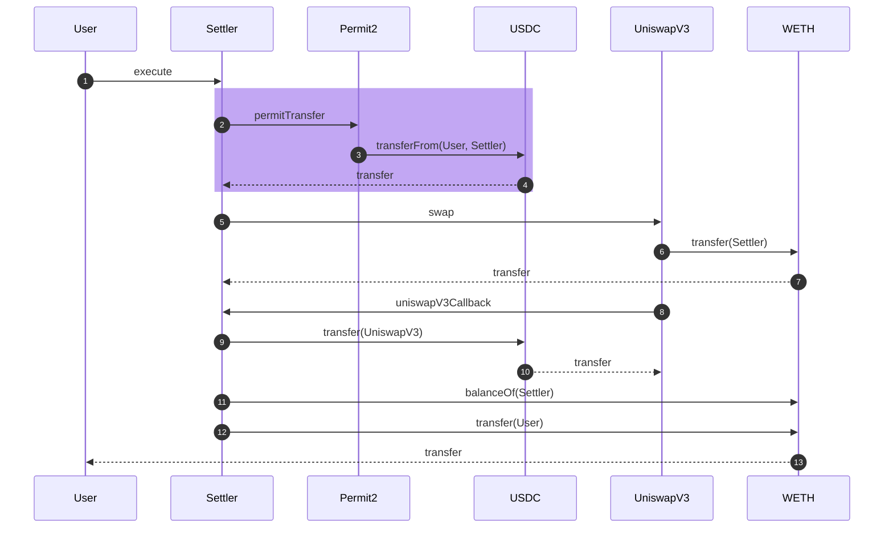

The above example shows the simplest form of settlement in Settler. We abuse
some of the sequence diagram notation to get the point across. Token transfers
are represented by dashes (-->). Normal contract calls are represented by solid
lines. Highlighted in purple is the Permit2 interaction.

For the sake of brevity, following diagrams will have a simplified
representation to showcase the internal flow. This is what we are actually
interested in describing. The initial user interaction (e.g their call to
Settler) and the final transfer is omitted unless it is relevant to highlight in
the flow. Function calls to the DEX may only be representative of the flow, not
the accurate function name.

Below is the simplified version of the above flow.

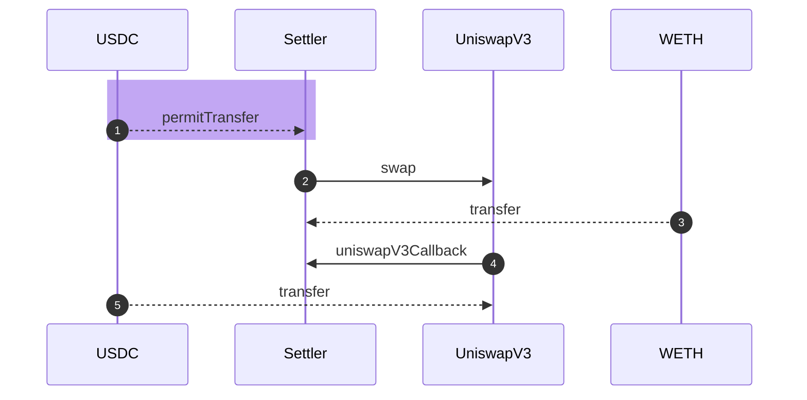

## `BASIC` Flow

This is the most basic flow and a flow that a number of dexes
support. Essentially it is the "call function on DEX, DEX takes tokens from us,
DEX gives us tokens". It has inefficiencies as `transferFrom` is more gas
expensive than `transfer` and we are required to check/set allowances to the
DEX. Typically this DEX also does not support a `recipient` field, introducing
yet another needless `transfer` in simple swaps.

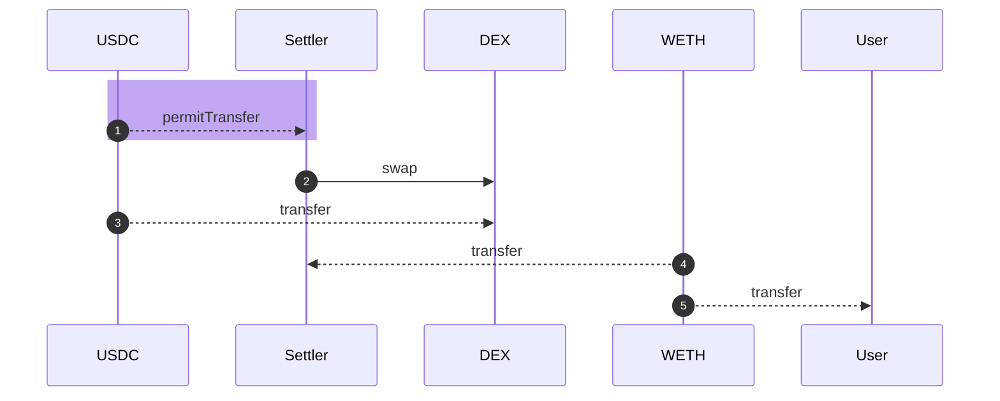

## VIPs

Settler has a number of specialised fill flows and will add more overtime as we
add support for more dexes.

### UniswapV3

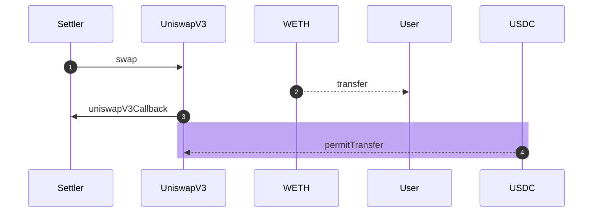

In this flow we avoid extraneous transfers with two optimisations. Firstly, we
utilise the `recipient` field of UniswapV3, providing the User as the recipient
and avoiding an extra transfer. Secondly during the `uniswapV3Callback` we
execute the Permit2 transfer, paying the UniswapV3 pool instead of the Settler
contract, avoiding an extra transfer.

This allows us to achieve **no custody** during this flow and is an extremely
gas efficient way to fill a single UniswapV3 pool, or single chain of UniswapV3
pools.

Note this has the following limitations:

- Single UniswapV3 pool or single chain of pools (e.g ETH->DAI->USDC)
- Cannot support a split between pools (e.g ETH->USDC 5bps and ETH->USDC 1bps)
  as Permit2 transfer can only occur once. a 0xV4 equivalent would be
  `sellTokenForTokenToUniswapV3` as opposed to
  `MultiPlex[sellTokenForEthToUniswapV3,sellTokenForEthToUniswapV3]`.

## RFQ

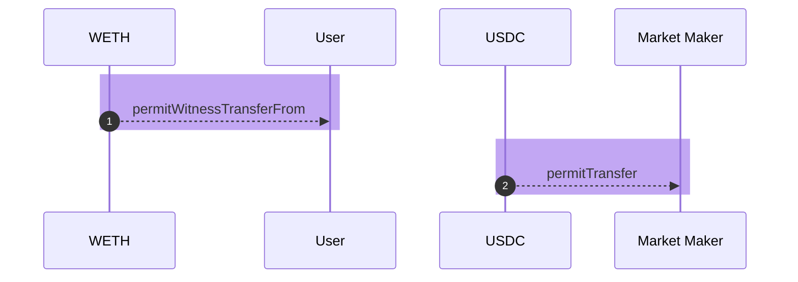

For RFQ we utilize 2 Permit2 transfers, one for the `Market Maker->User` and
another for `User->Market Maker`. This allows us to achieve **no custody**
during this flow and is an extremely gas efficient way to fill RFQ orders. We
simply validate the RFQ order (e.g Taker/msg.sender).

Note the `permitWitnessTransferFrom`, we utilise the `witness` functionality of
Permit2 which allows arbitrary data to be attached to the Permit2 coupon. This
arbitrary data is the actual RFQ order itself, containing the taker/msg.sender
and maker/taker amount and token fields.

A Market maker signs a slightly different Permit2 coupon than a User which
contains additional fields. The EIP712 type the Market Maker signs is as
follows:

```
PermitWitnessTransferFrom(TokenPermissions permitted,address spender,uint256 nonce,uint256 deadline,Consideration consideration)
Consideration(address token,uint256 amount,address counterparty,bool partialFillAllowed)
TokenPermissions(address token,uint256 amount)"
```

With values as follows

```json
{
    permitted: {
        token: makerToken,
        amount: makerAmount
    },
    spender: settlerAddress,
    nonce: unOrderedNonce,
    deadline: deadlineUnixTimestamp,
    consideration: {
        token: takerToken,
        amount: takerAmount,
        counterParty: taker,
        partialFillAllowed: partialFillAllowed
    }
}
```

We use the Permit2 guarantees of a Permit2 coupon to ensure the following:

- RFQ Order cannot be filled more than once
- RFQ Orders expire
- RFQ Orders are signed by the Market Maker

## Fees in Basic Flow

In the most Basic flow, Settler has **taken custody**, usually in both
assets. So a fee can be paid out be Settler.

### Sell token fee

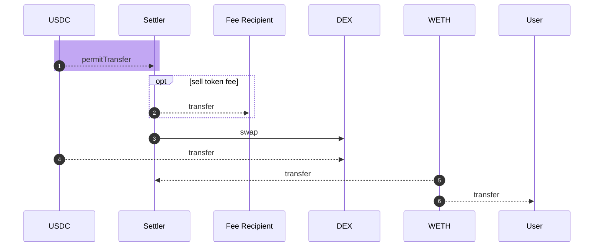

While it is possible to utilise Permit2 to pay out the Sell token fee using a
batch permit, we do not use that feature in Settler due to the substantial gas
overhead in the single-transfer case.


<details>
<summary>potential batch flow CURRENTLY UNUSED</summary>

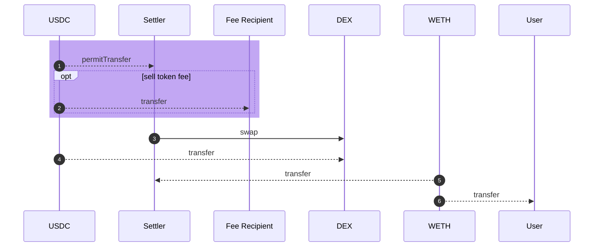

</details>

### Buy token fee

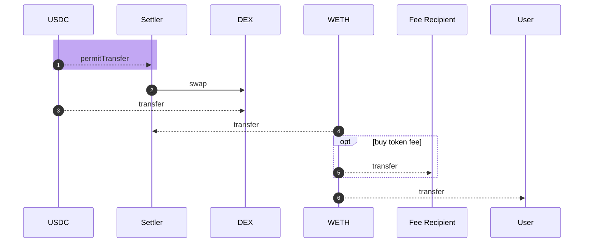

<details>

<summary>potential batch flow CURRENTLY UNUSED</summary>

## Fees via Permit2

It is possible to collect fees via Permit2, which is typically in the token that
the Permit2 is offloading (e.g the sell token for that counterparty). To perform
this we use the Permit2 batch functionality where the second item in the batch
is the fee.

### RFQ fees via Permit2

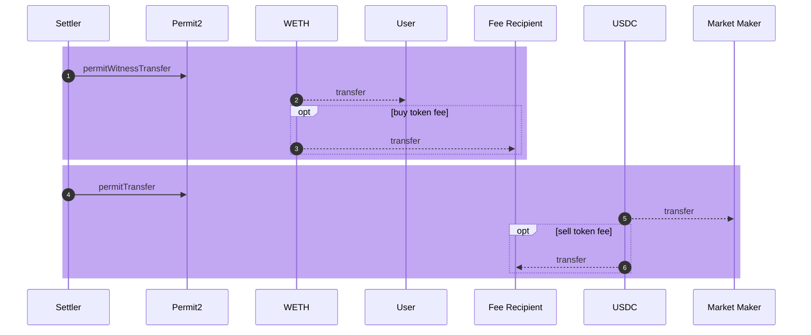

Using the Batch functionality we can do one or more transfers from either the
User or the Market Maker. Allowing us to take either a buy token fee or a sell
token fee, or both, during RFQ order settlement.

This allows us to achieve **no custody** during this flow and is an extremely
gas efficient way to fill RFQ orders with fees.

### Uniswap VIP sell token fees via Permit2

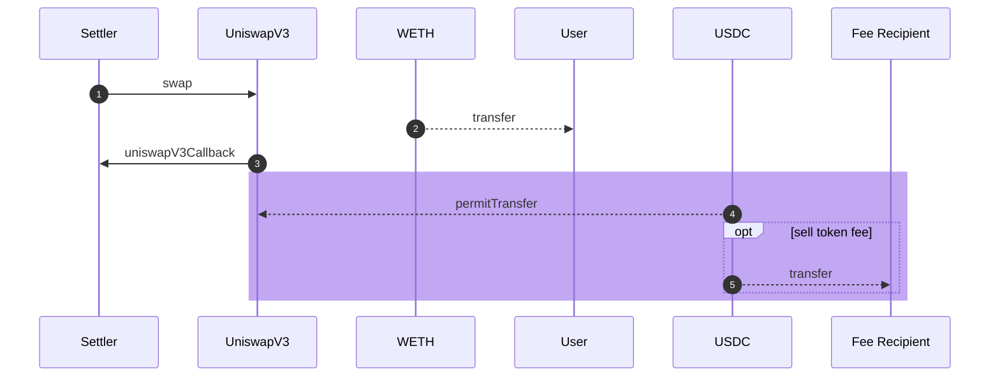

It is possible to collect sell token fees via Permit2 with the UniswapV3 VIP as
well, using the Permit2 batch functionality. This flow is similar to the RFQ
fees.

This allows us to achieve **no custody** during this flow and is an extremely
gas efficient way to fill UniswapV3 with sell token fees.

</details>

### Uniswap buy token fees via Permit2

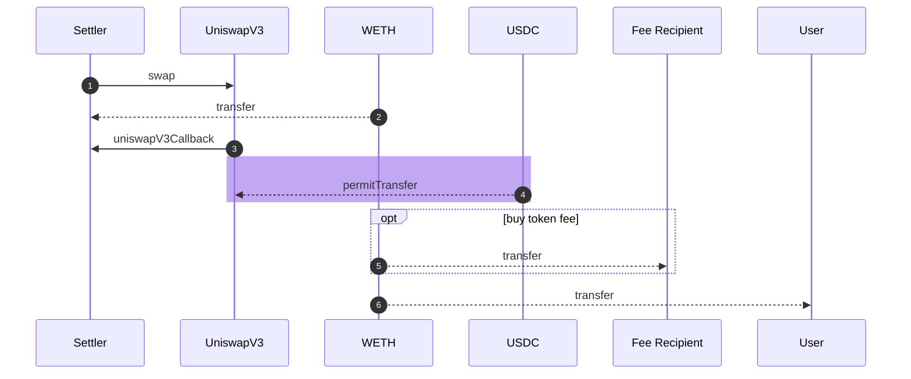

Since UniswapV3 only supports a single `recipient`, to collect buy token fees,
Settler must **take custody** of the buy token. These additional transfers makes
settlement with UniswapV3 and buy token fees slightly more expensive than with
sell token fees.

## MetaTransactions

Similar to RFQ orders, MetaTransactions use the Permit2 with witness. In this
case the witness is the MetaTransaction itself, containing the actions the user
wants to execute. This gives MetaTransactions access to the same flows above,
with a different entrypoint contract and function signature. In this case, the
signature is a separate argument from the actions so that the actions can be
signed-over by the metatransaction taker.

The EIP712 type the user signs when wanting to perform a metatransaction is:

```
PermitWitnessTransferFrom(TokenPermissions permitted,address spender,uint256 nonce,uint256 deadline,SlippageAndActions slippageAndActions)
SlippageAndActions(address recipient,address buyToken,uint256 minAmountOut,bytes[] actions)
TokenPermissions(address token,uint256 amount)
```

Where `actions` is added and contains the encoded actions the to perform.

## AllowanceHolder

As an intermediary step, we provide the `AllowanceHolder` contract. This sits
infront of Settler and acts as transparently as possible. 0x Settler has a one
way trust relationship to `AllowanceHolder`. The true `msg.sender` is forwarded
from `AllowanceHolder` to 0x Settler in a similar way to
[ERC-2771](https://eips.ethereum.org/EIPS/eip-2771). `Permit2` is not used in
conjunction with `AllowanceHolder`

`exec`: An EOA or a smart contract wallet can utilise this function to perform a
swap via 0x Settler. Tokens are transferred efficiently and on-demand as the
swap executes. Unlike in Permit2 flows, it is possible to make multiple
optimized transfers of the same ephemeral allowance without reauthorizing.

Highlighted in orange is the standard token transfer operations. Note: these are
not the most efficient swaps available, just enough to demonstrate the point.

`transferFrom` transfers the tokens on demand in the middle of the swap

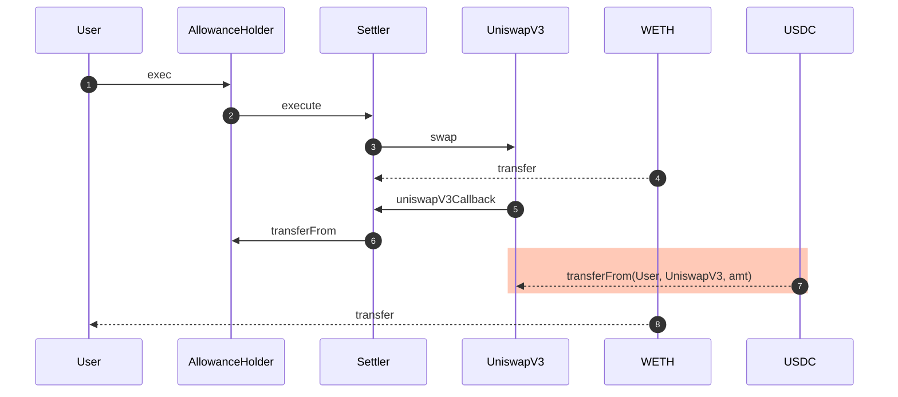

# How to deploy

## How to pause the contracts

First, decide how much of everyone's day you're going to ruin. Is the bug
contained to a single `Settler` instance? Or is the bug pervasive? If the bug is
pervasive, you're going to completely ruin everybody's day. Skip steps 3 through
6 below.

You need to be an approved deployer. The "pause" operation is 1-of-n, not 2-of-n
like deploying a new `Settler`. `0x1CeC01DC0fFEE5eB5aF47DbEc1809F2A7c601C30`
(ice cold coffees) is the address of the pauser contract. It's at the same
address on all chains unless somebody screwed up the vanity addresses and didn't
update this document.

0. Go to that address on the relevant block explorer.

1. Click on the "Contract" tab.


2. Click on the "Write Contract" tab.


3. Click on "remove", the first one.


4. Click on "Connect to Web3" and allow your wallet to connect. You must connect
   with the address that you use to deploy.


5. Paste the address of the buggy `Settler` instance.


6. Click "Write" and confirm the transaction in your wallet. You have successfully ruined everybody's day :+1:


7. This is the step to take if you want to completely shut down the
   protocol. You really hate that everybody is having a nice day. Instead of
   clicking on "remove"; click on "removeAll".

8. Click on "Connect to Web3" and allow your wallet to connect. You must connect
   with the address that you use to deploy.


9. Enter the "feature" number in the text box. This is probably 2 for
   taker-submitted, 3 for gasless/metatransaction, 4 for intents, or 5 for
   bridge settler, unless something major has changed and nobody bothered
   to update this document.


10. Click "Write" and confirm the transaction in your wallet. You have _really_ ruined everybody's day :+1:


## How to deploy a new `Settler` to a chain that is already set up

Populate `api_secrets.json` by copying
[`api_secrets.json.template`](api_secrets.json.template) and adding your own
block explorer API key and RPC.

You need 2 signers to do this. Each signer needs to run
[`./sh/confirm_new_settler.sh
<CHAIN_NAME>`](sh/confirm_new_settler.sh). Following the prompts, this will sign
the Safe transaction required to submit the deployment. Once two signers have
run this script, the transaction will appear in the [Safe
dApp](https://app.safe.global/) as a pending transaction. Anybody can pay the
gas to execute this, but probably whoever holds `deployer.zeroexprotocol.eth`
will do it (presently Duncan).

On some chains, the [Safe Transaction
Service](https://docs.safe.global/core-api/transaction-service-overview) doesn't
exist. On these chains, instead of uploading the signature to be viewed in the
Safe dApp, `confirm_new_settler.sh` will save a `*.txt` file containing a hex
encoded 65-byte signature. This file needs to be sent verbatim (with filename
intact) to whomever will be doing transaction submission (again,
`deployer.zeroexprotocol.eth` -- presently Duncan). Then the person doing
transaction submission places _both_ `*.txt` files in the root of this
repository and runs [`./sh/deploy_new_settler.sh
<CHAIN_NAME>`](sh/deploy_new_settler.sh). This interacts with the Safe contracts
directly without going through the Safe dApp. The downside of this approach is
the lack of the extremely helpful [Tenderly](https://dashboard.tenderly.co/)
integration that helps review the transaction before submission. Of course, it's
possible to do similar simulations with Foundry, but the UX is much worse.

Now that the contract is deployed on-chain you need to run
[`./sh/verify_settler.sh <CHAIN_NAME>`](sh/verify_settler.sh). This will
(attempt to) verify Settler on both the Etherscan for the chain and
[Sourcify](https://sourcify.dev/). If this fails, try deploying the contracts in
the normal way (without going through the 2 signer ceremony above) to a testnet
and verifying them there to make sure this doesn't happen.

## How to deploy to a new chain

Zeroth, verify the configuration for your chain in
[`chain_config.json`](chain_config.json),
[`api_secrets.json.template`](api_secrets.json.template), and
[`script/SafeConfig.sol`](script/SafeConfig.sol). Add the new chain to the list
of `AllowanceHolder` addresses at the top of this file. Pay attention to the
`extraFlags` and `extraScriptFlags` fields. `extraFlags` should be `--legacy` on
L2s that bill the DA fee directly in the native asset (e.g. OP stack
rollups). `extraScriptFlags` should have `--isolate` on chains that aren't
EraVM. `extraScriptFlags` should have `--skip-simulation` on chains with weird
gas rules (i.e. Arbitrum, Mantle, Monad, MegaEth).

First, you need somebody to give you a copy of `secrets.json`. If you don't have
this, give up. Install [`scrypt`](https://github.com/Tarsnap/scrypt) and use it
to encrypt `secrets.json` to `secrets.json.scrypt`. Also populate
`api_secrets.json` by copying
[`api_secrets.json.template`](api_secrets.json.template) and adding your own
block explorer API key and RPC.

Second, test for common opcode support:

<details>
<summary>Click for instructions on how to run opcode tests</summary>

```bash
export FOUNDRY_EVM_VERSION=london
declare -r deployer_eoa='YOUR EOA ADDRESS HERE'
declare -r rpc_url='YOUR RPC URL HERE' # http://127.0.0.1:1248 if using frame.sh
declare -r -i chainid='CHAIN ID TO TEST HERE'
forge clean
forge build src/ChainCompatibility.sol
declare txid
# you might need to add the `--gas-price` and/or `--gas-limit` flags here; some chains are weird about that
txid="$(cast send --json --rpc-url "$rpc_url" --chain $chainid --from $deployer_eoa --create "$(forge inspect src/ChainCompatibility.sol:ChainCompatibility bytecode)" | jq -rM .transactionHash)"
declare -r txid
cast receipt --json --rpc-url "$rpc_url" $txid | jq -r '.logs[] | select(.address == $compatibilityTester) | { stage: .data[2:66], success: .data[66:130], gas: .data[130:] }' --arg compatibilityTester "$(cast receipt --json --rpc-url "$rpc_url" $txid | jq -rM .contractAddress)"
```

The `stage` fields should be in order (0 through 4). Stage 0 is
`SELFDESTRUCT`. Stage 1 is `PUSH0`. Stage 2 is `TSTORE`/`TLOAD`. Stage 3 is
`MCOPY`. Stage 4 is `CLZ`. If any entry has `success` of zero, that is strong
evidence that the corresponding opcode is not supported. If `success` is zero,
the corresponding `gas` value should be approximately 100000
(`0x186a0`). Another value in the `gas` field suggests that something bizarre is
going on, meriting manual investigation. You can also use the `gas` field to see
if the opcodes have the expected gas cost. In particular, you should verify that
the gas cost for `SELFDESTRUCT` is approximately 5000 (`0x1388`). If `success`
for `SELFDESTRUCT` is 1, but `gas` is over 51220 (`0xc814`), you will need to
make changes to `Create3.sol`.

If `PUSH0` is not supported, then `hardfork.shanghai` should be `false` in
`chain_config.json`. If any of `TSTORE`/`TLOAD`/`MCOPY` are not supported, then
`hardfork.cancun` should be `false` in `chain_config.json`. If `CLZ` is not
supported, then `hardfork.osaka` should be `false` in `chain_config.json`.

You may be tempted to use a blockchain explorer (e.g. Etherscan or Tenderly) to
examine the trace of the resulting transaction or to read the logs. You may also
be tempted to do an `eth_call`, local fork, devnet, or some other form of
advanced simulation. _**DO NOT DO THIS**_. These tools cannot be trusted; they
**will** lie to you. You must submit this transaction on-chain, wait for it to
be confirmed, and then retrieve the receipt (like the above snippet). The
blockchain cannot lie about the logs emitted by a transaction that become part
of its receipt.

</details>

Third, create a new set of
`src/chains/<CHAIN_DISPLAY_NAME>/{Common,TakerSubmitted,MetaTxn,Intent,BridgeSettler}.sol`
files. A good way to start is by copying
[`src/chains/Sepolia/*.sol`](src/chains/Sepolia/). You'll need to change the
names of all the contracts, remove references to missing liquidity sources
(presently MaverickV2, UniswapV4, and Across), replace the `block.chainid` check
in the constructor (in both `Common.sol` and `BridgeSettler.sol`), and replace
the UniswapV3 forks. When adding new UniswapV3 forks, be sure that the `factory`
address is the address of the contract that `CREATE2`'s the pool. Triple check
that the deployed pools aren't upgradeable proxies and that the `data` argument
is passed through the callback unmodified. _**This is critical for security.**_
Some chains have a form of sequencer fee sharing or other chain-specific
deploy-time setup. Configure this in the constructor of the Settler (and ideally
in the constructor of the Deployer, remembering that this is complicated by the
fact that the Deployer is a proxy). See the deployments to Blast and to Mode for
examples.

Fourth, deploy `MultiCall`. Run [`BROADCAST=no ./sh/deploy_multicall.sh
<CHAIN_NAME>`](sh/deploy_multicall.sh). Then switch to `BROADCAST=yes` to
actually do the deployment. This one is low-stakes because if you mess it up and
it reverts, you can just try again. This deploys using the [Arachnid
deterministic deployment
proxy](https://github.com/Arachnid/deterministic-deployment-proxy). If you mess
it up, make sure you learn from your mistakes for the next step.

Fifth, deploy `CrossChainReceiverFactory`. Send 2 wei of value to the wnative
storage setter address (`0x000000000000F01B1D1c8EEF6c6cF71a0b658Fbc` unless
something has gone very wrong). Run the deployment script in simulation mode
[`DECRYPT_SECRETS=no BROADCAST=no ./sh/deploy_crosschainfactory.sh
<CHAIN_NAME>`](sh/deploy_crosschainfactory.sh). On EraVM chains, simulation
doesn't work correctly; you can temporarily substitute the EraVM-native
non-forwarding multicall in `chain_config.json` with the EVM one from another
chain to fix this. On chains without `SELFDESTRUCT` support, you will need to
edit the script to comment-out the cleanup calls to `"$shim"` and
`"$wnative_storage"` (the ones with a payload/calldata of `0x00000000`). Then
fully fund the wnative storage setter address (it takes about 1.4Mgas; give
yourself some buffer and adjust for the prevailing gas price) and re-run with
`BROADCAST=yes` (and without `DECRYPT_SECRETS=no`). It's annoying if you mess
this one up, but it is (probably) recoverable because the vanity comes from the
Arachnid deployer rather than from the EVM itself.

Sixth, deploy `AllowanceHolder`. Obviously, if you're deploying to a
Cancun-supporting chain, you don't need to fund the deployer for the old
`AllowanceHolder` (and vice versa). Run [`BROADCAST=no
./sh/deploy_allowanceholder.sh
<CHAIN_NAME>`](sh/deploy_allowanceholder.sh). Then switch to `BROADCAST=yes` to
actually do the deployment. Don't mess this one up. You will burn the vanity
address.

Seventh, check that the Safe deployment on the new chain is complete. You can
check this by running the main deployment script with `BROADCAST=no`. If it
completes without reverting, you don't need to do anything. If the Safe
deployment on the new chain is incomplete, run [`./sh/deploy_safe_infra.sh
<CHAIN_NAME>`](sh/deploy_safe_infra.sh). You will have to modify this script.

Eighth, make _damn_ sure that you've got the correct configuration in
[`chain_config.json`](chain_config.json). If you screw this up, you'll burn the
vanity address. Run [`BROADCAST=no ./sh/deploy_new_chain.sh
<CHAIN_NAME>`](sh/deploy_new_chain.sh) a bunch of times. Deploy to a testnet. If
you are deploying to a chain with an alternate VM (i.e. EraVM [i.e. zkSync,
Abstract]), you _**MUST**_ deploy to a testnet to verify that everything is
working properly. Simulate each individual transaction in
[Tenderly](https://dashboard.tenderly.co/).

Ninth, you need have enough native asset in _**each**_ of the deployer addresses
(there are two: `iceColdCoffee` and `deployer`) listed in
[`secrets.json.template`](secrets.json.template) to perform the deployment. If
how much isn't obvious to you, you can run the main deployment script with
`BROADCAST=no` to simulate. The `"iceColdCoffee"` address needs ~50% more native
asset than the `"deployer"` address because the final transaction of the
deployment is extremely gas-intensive. The amount of ETH you need can be a
little wonky on L2s, so beware and overprovision the amount of native asset.

Finally, run `BROADCAST=yes ./sh/deploy_new_chain.sh <CHAIN_NAME>`. Cross your
fingers. If something goes wrong (most commonly, the last transaction runs out
of gas; this is only a minor problem), you'll need to edit either
`sh/deploy_new_chain.sh` or
[`script/DeploySafes.s.sol`](script/DeploySafes.s.sol) to skip the parts of the
deployment you've already done. Tweak `gasMultiplierPercent` and
`minGasPriceGwei` in `chain_config.json`.

Congratulations, `Settler` is deployed on a new chain! :tada:
